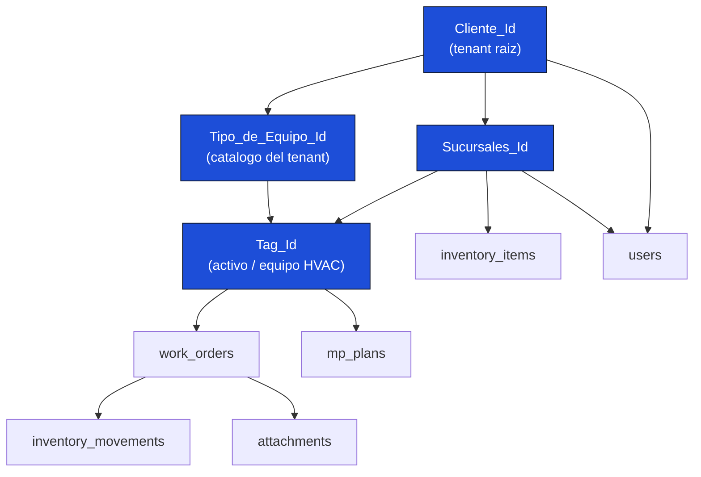
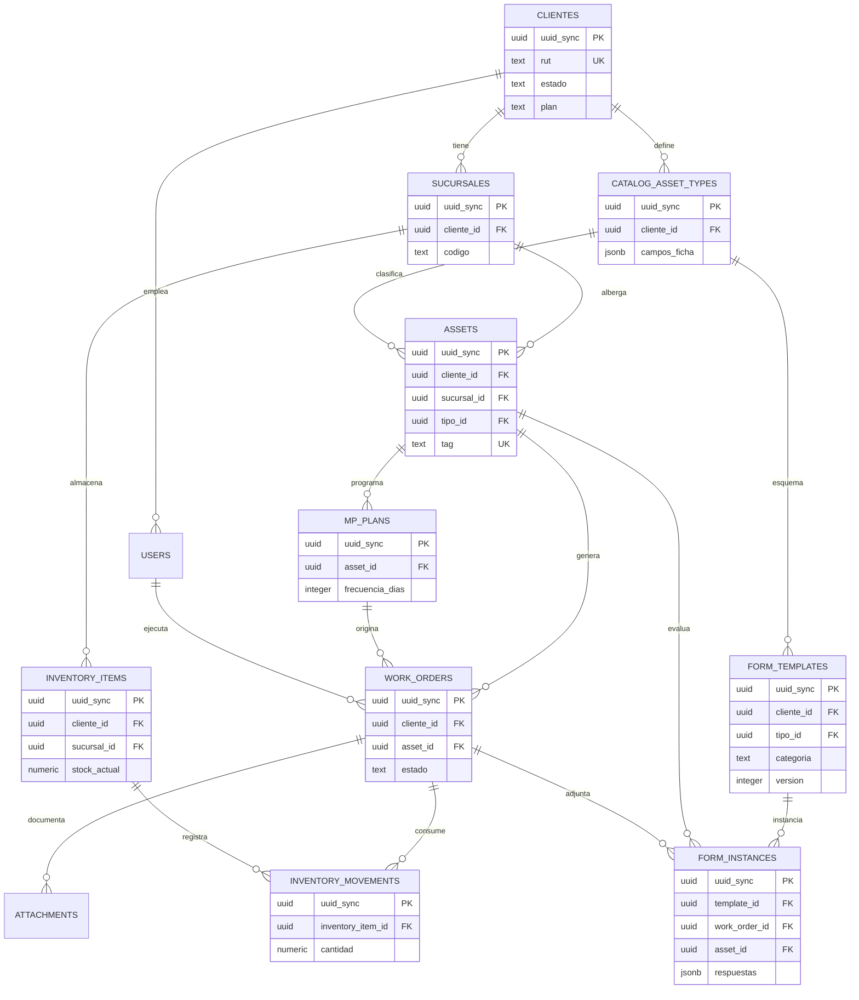
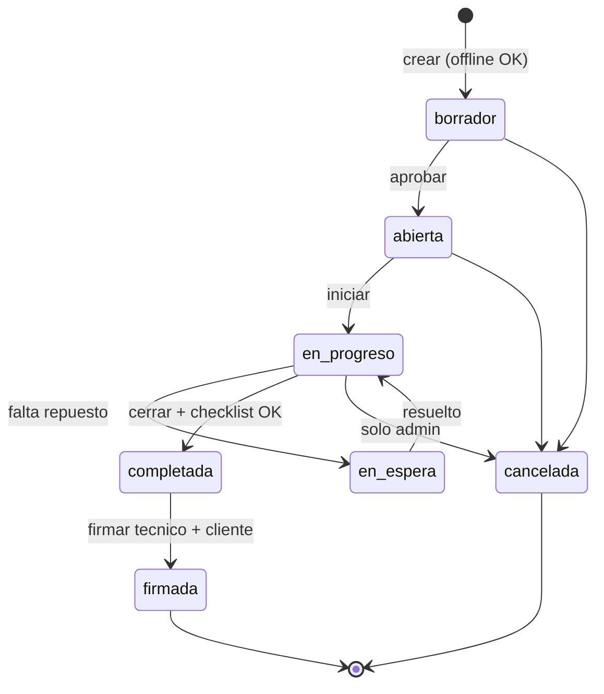
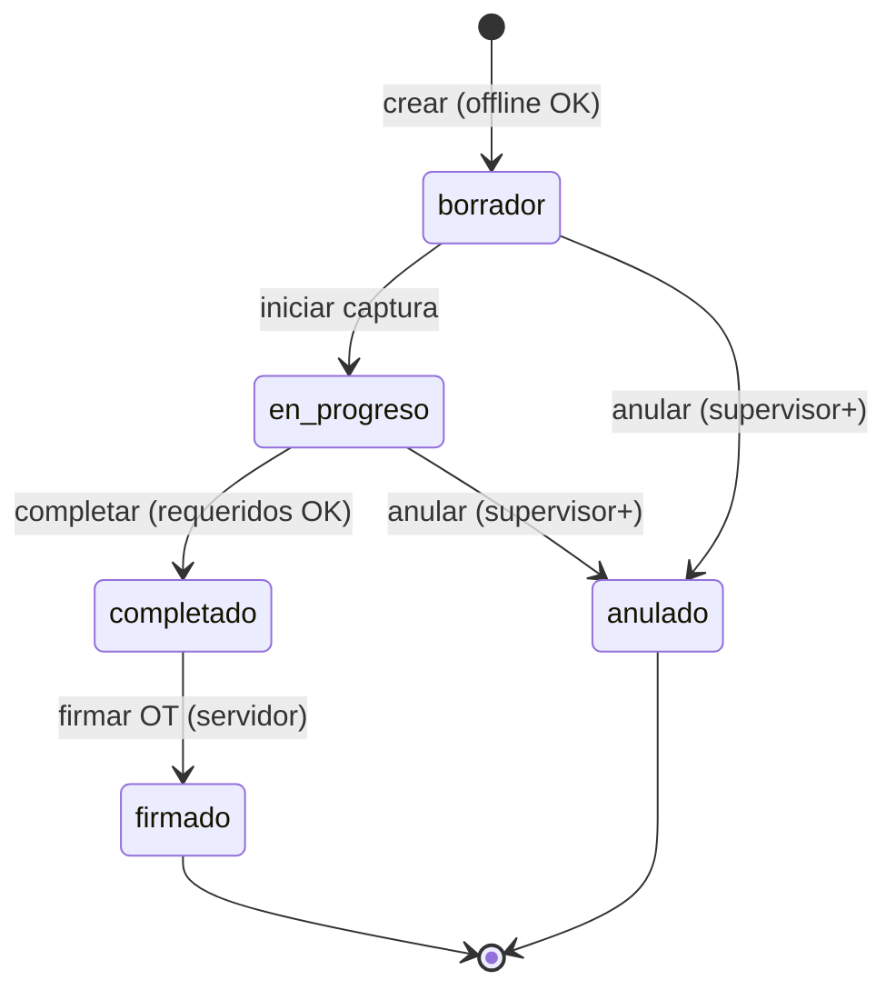

# CMMS HVAC PRO — Reglas de Negocio

**Versión 1.0 — Junio 2026**
**Columna vertebral de la aplicación offline-first multi-tenant**
**Documento hermano:** `CMMS_HVAC_PRO_Especificacion_Tecnica_v5.md`

| Control de Documento | Detalle |
|---|---|
| Tipo | Reglas de negocio normativas — vinculantes |
| Propósito | Definir la columna vertebral de datos interrelacionados multi-tenant |
| Alcance | Modelo offline-first con sincronización eventual |
| Claves maestras | `Cliente_Id` · `Sucursales_Id` · `Tipo_de_Equipo_Id` · `Tag_Id` |
| Audiencia | Arquitecto · Backend · Frontend · DBA · QA |

---

## Índice

- [0. Cómo leer este documento](#0-como-leer)
- [1. La Columna Vertebral Multi-Tenant](#1-columna)
- [2. Modelo Entidad-Relación](#2-modelo-er)
- [3. Reglas de Identidad (RN-ID)](#3-rn-id)
- [4. Reglas de Multi-Tenancy (RN-TEN)](#4-rn-ten)
- [5. Reglas de Activos (RN-ACT)](#5-rn-act)
- [6. Reglas de Órdenes de Trabajo (RN-OT)](#6-rn-ot)
- [7. Reglas de Inventario (RN-INV)](#7-rn-inv)
- [8. Reglas de Mantenimiento Preventivo (RN-MP)](#8-rn-mp)
- [9. Reglas de Sincronización (RN-SYNC)](#9-rn-sync)
- [10. Reglas de Seguridad (RN-SEG)](#10-rn-seg)
- [11. Reglas de Folios (RN-FOL)](#11-rn-fol)
- [12. Matriz de Integridad Referencial](#12-integridad)
- [13. Catálogo de Estados y Transiciones](#13-estados)
- [14. Reglas de Formularios y Checklists Modulares (RN-FORM)](#14-rn-form)

---

## 0. Cómo leer este documento

Cada regla de negocio sigue esta estructura normativa:

| Atributo | Significado |
|---|---|
| **ID** | Identificador único (p. ej. `RN-OT-03`) |
| **Enunciado** | La regla en lenguaje claro |
| **Dónde se evalúa** | `Cliente` (Dexie/zod) · `Servidor` (Neon/API) · `Ambos` |
| **Comportamiento offline** | Qué ocurre cuando no hay conexión |
| **En conflicto** | Cómo se resuelve si hay colisión en la sincronización |

**Principio rector:** en una app offline-first, **cada regla de negocio es también un contrato de datos**. Una regla que solo vive en la UI no existe: debe estar respaldada por una restricción en el servidor (constraint, trigger o validación de API).

---

## 1. La Columna Vertebral Multi-Tenant

La aplicación entera se sostiene sobre una **cadena de contención jerárquica** de cuatro claves. Toda entidad del sistema cuelga de esta cadena, y el aislamiento de datos entre clientes (tenants) se hereda por la rama.

### 1.1 Significado de cada clave

| Clave | Entidad | Rol en la jerarquía | Cardinalidad |
|---|---|---|---|
| `Cliente_Id` | `clientes` | **Tenant raíz.** Aísla todos los datos. Nadie ve datos de otro `Cliente_Id` (salvo rol `programador`). | 1 |
| `Sucursales_Id` | `sucursales` | Ubicación física del cliente. Contiene activos e inventario. | 1 Cliente → N Sucursales |
| `Tipo_de_Equipo_Id` | `catalog_asset_types` | Catálogo de tipos de equipo del cliente. Define la ficha técnica dinámica y el checklist MP por defecto. | 1 Cliente → N Tipos |
| `Tag_Id` | `assets` | Identidad del equipo HVAC físico. Pertenece a una Sucursal y es de un Tipo. | 1 Sucursal → N Activos; 1 Tipo → N Activos |

### 1.2 La Regla de Oro del Aislamiento

> **RN-CORE-01 — Aislamiento por rama.**
> Ninguna entidad puede referenciar una clave que pertenezca a una rama de otro `Cliente_Id`. Un `Tag_Id` debe pertenecer a una `Sucursales_Id` cuyo `Cliente_Id` coincida con el del usuario autenticado. Toda violación se rechaza de forma **permanente** con `FK_VIOLATION` o `TENANT_MISMATCH` (nunca se reasigna el tenant silenciosamente).

---

## 2. Modelo Entidad-Relación

---

## 3. Reglas de Identidad (RN-ID)

### RN-ID-01 — Identidad universal `uuid_sync`
- **Enunciado:** Toda entidad sincronizable tiene un `uuid_sync` (UUID v4) generado en el **cliente** con `crypto.randomUUID()`. Es la clave primaria real y es inmutable de por vida.
- **Dónde se evalúa:** Ambos.
- **Offline:** Se genera localmente sin necesidad de servidor; permite crear registros 100% offline.
- **Conflicto:** Imposible por diseño — la probabilidad de colisión de UUID v4 es despreciable.

### RN-ID-02 — Folio humano solo del servidor
- **Enunciado:** El identificador legible (`id`, p. ej. `OT-2026-000123`) lo asigna **exclusivamente** el servidor al sincronizar. En el cliente es `null` hasta confirmación.
- **Dónde se evalúa:** Servidor.
- **Offline:** El registro vive con `id = null`; la UI muestra "pendiente de folio".
- **Conflicto:** No aplica — el servidor es la única fuente del folio.

### RN-ID-03 — El QR codifica `uuid_sync`, no el Tag
- **Enunciado:** El código QR de un activo codifica `cmms://asset/{uuid_sync}`, nunca el `tag`. El tag puede corregirse; la identidad no.
- **Dónde se evalúa:** Servidor (columna generada).
- **Offline:** El QR se genera desde el `uuid_sync` ya disponible localmente.
- **Conflicto:** No aplica.

---

## 4. Reglas de Multi-Tenancy (RN-TEN)

### RN-TEN-01 — Todo registro pertenece a un `Cliente_Id`
- **Enunciado:** Toda entidad de negocio lleva `cliente_id` no nulo que la ancla a un tenant.
- **Dónde se evalúa:** Ambos (zod `uuid()` + FK `NOT NULL`).
- **Offline:** El `cliente_id` se toma de la sesión del usuario, disponible localmente.
- **Conflicto:** Si el `cliente_id` no coincide con el del JWT → `TENANT_MISMATCH` permanente.

### RN-TEN-02 — Aislamiento de lectura
- **Enunciado:** Un usuario solo recibe en el pull los registros de su `cliente_id`. El rol `programador` es la única excepción (cruza tenants).
- **Dónde se evalúa:** Servidor (filtro en `/api/sync/pull`).
- **Offline:** El cliente solo tiene en Dexie los datos de su tenant; no hay fuga posible.
- **Conflicto:** No aplica.

### RN-TEN-03 — Alcance por sucursal del técnico
- **Enunciado:** Un `tecnico` solo accede a activos y OT de sus `sucursales_asignadas`. Un `supervisor` accede a todas las sucursales de su tenant.
- **Dónde se evalúa:** Servidor (RBAC + filtro de pull).
- **Offline:** Dexie solo contiene los registros dentro del alcance ya descargado.
- **Conflicto:** No aplica.

### RN-TEN-04 — Límites por plan
- **Enunciado:** El `plan` del cliente (`starter`/`pro`/`enterprise`) define límites (p. ej. máximo de activos). Superarlo bloquea altas con `PLAN_LIMIT`.
- **Dónde se evalúa:** Servidor.
- **Offline:** El cliente puede crear localmente; el servidor rechaza al sincronizar si excede.
- **Conflicto:** El registro excedente queda `failed` con `PLAN_LIMIT` en el panel de errores.

---

## 5. Reglas de Activos (RN-ACT)

### RN-ACT-01 — Tag único por cliente
- **Enunciado:** El `tag` de un activo es único dentro de un mismo `cliente_id` (no globalmente). El formato canónico auto-generado se define en **RN-ACT-06**; se acepta además `^[A-Z0-9]+(\.[A-Z0-9]+)*$` para tags manuales/legados (p. ej. `STGO.AZ.001`).
- **Dónde se evalúa:** Ambos (zod regex + `UNIQUE (cliente_id, tag)`).
- **Offline:** El cliente valida el formato; la unicidad real se confirma en el servidor.
- **Conflicto:** Tag duplicado en el mismo tenant → `DUPLICATE_KEY` permanente.

### RN-ACT-02 — Coherencia de rama Sucursal-Tipo
- **Enunciado:** Un activo referencia una `sucursal_id` y un `tipo_id` que deben pertenecer al mismo `cliente_id` del activo.
- **Dónde se evalúa:** Servidor (FK + verificación de tenant).
- **Offline:** El cliente solo ofrece sucursales/tipos de su tenant en los selects.
- **Conflicto:** Referencia cruzada de tenant → `FK_VIOLATION` permanente.

### RN-ACT-03 — Ficha técnica validada contra el Tipo
- **Enunciado:** Los campos de `ficha_tecnica` de un activo deben cumplir el esquema `campos_ficha` definido en su `Tipo_de_Equipo_Id`. Los campos `requerido: true` son obligatorios.
- **Dónde se evalúa:** Ambos (zod dinámico + trigger `validate_ficha_tecnica`).
- **Offline:** El formulario se construye dinámicamente desde el catálogo descargado.
- **Conflicto:** Campo requerido ausente → `FICHA_FIELD_REQUIRED`.

### RN-ACT-04 — Baja de activo restringida
- **Enunciado:** Cambiar `estado_operativo` a `baja` requiere rol `supervisor` o superior.
- **Dónde se evalúa:** Ambos (UI oculta acción + RBAC servidor).
- **Offline:** La UI restringe según el rol en sesión.
- **Conflicto:** Técnico intenta dar de baja → `FORBIDDEN`.

### RN-ACT-05 — No se borra, se da de baja
- **Enunciado:** Los activos no se eliminan físicamente; se marcan con `estado_operativo='baja'` y/o `deleted_at` (soft-delete), conservando el historial de OT.
- **Dónde se evalúa:** Ambos.
- **Offline:** El soft-delete se propaga como tombstone en el pull.
- **Conflicto:** LWW por `updated_at` del servidor.

### RN-ACT-06 — Composición del Tag_Id
- **Enunciado:** El `Tag_Id` canónico se compone como `id_sucursal.tipo_de_equipo.nro_serie` con máscara `0000000.0000.000` (7 + 4 + 3 dígitos): sucursal (`codigo_num`), tipo de equipo (`codigo_num`) y correlativo de serie por `(cliente, sucursal, tipo)`. Ej.: `0000012.0003.007`.
- **Dónde se evalúa:** Ambos (CHECK `^\d{7}\.\d{4}\.\d{3}$` + composición en servidor).
- **Offline:** El activo se crea con `uuid_sync` y un tag provisional con formato `PEND.<short>` (p. ej. `PEND.A1B2C3`), válido frente al CHECK y de uso solo para mostrar hasta el sellado.
- **Conflicto:** No aplica — el correlativo lo sella el servidor (RN-ACT-07).

### RN-ACT-07 — Generación del correlativo sellada por servidor
- **Enunciado:** El segmento `nro_serie` lo asigna **exclusivamente** el servidor desde `asset_tag_sequences` (mismo patrón que los folios, RN-FOL). El cliente nunca inventa el correlativo.
- **Dónde se evalúa:** Servidor (trigger `assign_asset_tag`).
- **Offline:** El tag definitivo se sella al sincronizar; hasta entonces la UI muestra "pendiente".
- **Conflicto:** Correlativo > 999 por rama+tipo → amplía a 4 dígitos y emite alerta `TAG_SERIAL_OVERFLOW` (no bloquea el alta).

---

## 6. Reglas de Órdenes de Trabajo (RN-OT)

### RN-OT-01 — Máquina de estados estricta
- **Enunciado:** Una OT solo transita por estados válidos (ver §13). Transiciones no permitidas se rechazan con `INVALID_TRANSITION`.
- **Dónde se evalúa:** Ambos (validación en UI + servidor).
- **Offline:** El cliente conoce la tabla de transiciones y bloquea las inválidas.
- **Conflicto:** Si dos dispositivos avanzan la misma OT, gana el servidor (LWW); si está firmada, ver RN-OT-04.

### RN-OT-02 — OT siempre sobre activo activo
- **Enunciado:** No se puede crear una OT sobre un activo en estado `baja`.
- **Dónde se evalúa:** Ambos.
- **Offline:** La UI advierte; el servidor rechaza con `ASSET_INACTIVE`.
- **Conflicto:** El registro queda `failed` si el activo fue dado de baja antes de sincronizar.

### RN-OT-03 — Cierre exige checklist completo
- **Enunciado:** Para pasar a `completada`, todos los ítems `requerido` del checklist deben estar completados.
- **Dónde se evalúa:** Ambos.
- **Offline:** La UI no permite cerrar con checklist incompleto.
- **Conflicto:** Servidor rechaza con `CHECKLIST_INCOMPLETE` si el payload llega incompleto.

### RN-OT-04 — OT firmada es inmutable
- **Enunciado:** Una vez en estado `firmada`, la OT no admite ninguna modificación. Se sella `firma_hash` (SHA-256) para garantizar integridad.
- **Dónde se evalúa:** Servidor (trigger `protect_signed_work_order`).
- **Offline:** La UI bloquea edición de OT firmadas.
- **Conflicto:** Cualquier update sobre una OT firmada → `IMMUTABLE_SIGNED_OT`; el cambio local se marca `conflicted`.

### RN-OT-05 — Consumo de materiales genera movimiento
- **Enunciado:** Al registrar `materiales_usados` en una OT, se genera un `inventory_movement` tipo `salida` por cada material consumido.
- **Dónde se evalúa:** Servidor.
- **Offline:** El consumo se captura localmente; el movimiento se materializa al sincronizar.
- **Conflicto:** Si el stock resultante baja del mínimo, se genera notificación `stock_bajo` (no bloquea).

### RN-OT-06 — Autoría y tiempos sellados
- **Enunciado:** `created_by`/`updated_by` registran el usuario; `fecha_inicio` se sella al pasar a `en_progreso`, `fecha_cierre` al `completada`, `fecha_firma` al `firmada` (por el servidor).
- **Dónde se evalúa:** Ambos (`captured_at` cliente, fechas oficiales servidor).
- **Offline:** Se guarda `captured_at` local para orden y auditoría.
- **Conflicto:** Las fechas oficiales las sella el servidor (P-2).

### RN-OT-07 — Estructura de la OT genérica firmable
- **Enunciado:** La OT genérica incluye cuatro cuadros de texto narrativos — `hallazgo`, `diagnostico`, `recomendaciones`, `conclusiones` — además del encabezado estándar (cliente, sucursal, activo, intervención). Se llenan manualmente o por *binding* desde checklists (RN-FORM-05).
- **Dónde se evalúa:** Ambos.
- **Offline:** Se capturan localmente; el *binding* compone valores al completar checklists.
- **Conflicto:** LWW por `updated_at` del servidor (salvo OT firmada, RN-OT-04).

### RN-OT-08 — La OT llama y adjunta checklists
- **Enunciado:** Una OT puede adjuntar 1..N Instancias de checklist (`form_instances.work_order_id`). El checklist HVAC nativo es el estándar; otras categorías (UPS, caldera, generador, vehículo) se adjuntan del mismo modo.
- **Reconciliación con el legado:** El `work_orders.checklist jsonb` embebido (RN-OT-03) se conserva como atajo del checklist por defecto del plan MP; el motor `form_instances` es la vía canónica para checklists extensibles y la OT genérica. Las categorías nuevas usan **siempre** `form_instances`. El cierre exige ambos completos (RN-OT-03 + RN-FORM-07).
- **Dónde se evalúa:** Ambos (FK + RN-FORM-07 para el cierre).
- **Offline:** Los checklists se diligencian offline y viajan en el mismo lote de sync.
- **Conflicto:** Cierre con checklist incompleto → `CHECKLIST_INCOMPLETE`.

---

## 7. Reglas de Inventario (RN-INV)

### RN-INV-01 — El stock solo cambia por movimientos
- **Enunciado:** `inventory_items.stock_actual` es una **columna derivada**: nunca se actualiza directamente. Solo cambia al insertar un `inventory_movement` (libro append-only).
- **Dónde se evalúa:** Servidor (trigger `apply_inventory_movement`).
- **Offline:** El cliente captura movimientos; el stock local se recalcula tras el pull.
- **Conflicto:** Movimientos concurrentes se serializan con `FOR UPDATE`; el stock nunca se corrompe.

### RN-INV-02 — Movimientos son inmutables (append-only)
- **Enunciado:** Un `inventory_movement` nunca se edita ni borra. Una corrección es un nuevo movimiento de tipo `ajuste` o `devolucion`.
- **Dónde se evalúa:** Servidor (sin endpoint de update/delete).
- **Offline:** Los movimientos se encolan y suben; jamás se modifican.
- **Conflicto:** No aplica — son hechos históricos.

### RN-INV-03 — Stock por sucursal
- **Enunciado:** El inventario pertenece a una `Sucursales_Id`. El mismo repuesto en dos sucursales son dos registros con stock independiente.
- **Dónde se evalúa:** Ambos (`UNIQUE (cliente_id, codigo)` por código de catálogo; stock por sucursal).
- **Offline:** El técnico ve el stock de sus sucursales.
- **Conflicto:** No aplica.

### RN-INV-04 — Alerta de stock bajo automática
- **Enunciado:** Cuando un movimiento deja `stock_actual < stock_minimo`, se genera una notificación `stock_bajo` a administradores y supervisores del tenant.
- **Dónde se evalúa:** Servidor (trigger).
- **Offline:** La alerta llega en el siguiente pull.
- **Conflicto:** No aplica.

### RN-INV-05 — Cantidad nunca cero
- **Enunciado:** Un movimiento debe tener `cantidad != 0` (positivo = entrada, negativo = salida).
- **Dónde se evalúa:** Ambos (zod + `CHECK (cantidad != 0)`).
- **Offline:** Validado en el formulario.
- **Conflicto:** `VALIDATION_ERROR`.

---

## 8. Reglas de Mantenimiento Preventivo (RN-MP)

### RN-MP-01 — Generación automática por frecuencia
- **Enunciado:** Un scheduler diario en el servidor genera OT preventivas cuando `proxima_ejecucion <= now() + alertar_dias_antes`.
- **Dónde se evalúa:** Servidor (Vercel Cron).
- **Offline:** No aplica (proceso de servidor); la OT generada llega por pull.
- **Conflicto:** No aplica.

### RN-MP-02 — No duplicar OT preventiva del mismo plan
- **Enunciado:** El scheduler no genera una nueva OT si ya existe una OT `abierta` o `en_progreso` de ese plan en el período.
- **Dónde se evalúa:** Servidor.
- **Offline:** No aplica.
- **Conflicto:** No aplica.

### RN-MP-03 — Recálculo de próxima ejecución
- **Enunciado:** Al completar una OT preventiva, `ultima_ejecucion` se actualiza y `proxima_ejecucion` se recalcula como `ultima_ejecucion + frecuencia_dias`.
- **Dónde se evalúa:** Servidor.
- **Offline:** La OT se cierra localmente; el recálculo ocurre al sincronizar.
- **Conflicto:** Servidor es la fuente de verdad de las fechas del plan.

### RN-MP-04 — Frecuencia positiva
- **Enunciado:** `frecuencia_dias` debe ser mayor que cero.
- **Dónde se evalúa:** Ambos (zod + `CHECK (> 0)`).
- **Offline:** Validado en formulario.
- **Conflicto:** `VALIDATION_ERROR`.

---

## 9. Reglas de Sincronización (RN-SYNC)

### RN-SYNC-01 — Sincronización idempotente
- **Enunciado:** Cada batch de push lleva un `batch_uuid`. Si el servidor recibe el mismo `batch_uuid` dos veces, devuelve el resultado original sin duplicar datos.
- **Dónde se evalúa:** Servidor (tabla `sync_log`).
- **Offline:** El cliente reintenta con el mismo `batch_uuid` tras un fallo de red.
- **Conflicto:** Imposible duplicar por diseño.

### RN-SYNC-02 — El servidor es dueño del tiempo
- **Enunciado:** `updated_at` lo sella exclusivamente el servidor. El `captured_at` del cliente solo sirve para auditoría y orden local.
- **Dónde se evalúa:** Servidor (trigger `seal_updated_at`).
- **Offline:** Se guarda `captured_at` local.
- **Conflicto:** El LWW se basa siempre en el tiempo del servidor.

### RN-SYNC-03 — Resolución LWW (Last Write Wins)
- **Enunciado:** Ante un conflicto, gana el registro con `updated_at` del servidor más reciente. Las entidades firmables (OT) usan resolución manual vía `ConflictModal`.
- **Dónde se evalúa:** Cliente (resolver) + Servidor (tiempo).
- **Offline:** El resolver se aplica al recibir el pull.
- **Conflicto:** Ver tabla de verdad en la especificación técnica §9.2.

### RN-SYNC-04 — Cola de fallidos con reintentos limitados
- **Enunciado:** Un ítem que falla por error temporal se reintenta con backoff exponencial + jitter, hasta 3 veces. Tras ello queda `failed` y aparece en el panel de errores de sincronización.
- **Dónde se evalúa:** Cliente (`syncEngine`).
- **Offline:** Los ítems permanecen en la cola hasta recuperar conexión.
- **Conflicto:** Errores permanentes (FK, validación) no se reintentan.

### RN-SYNC-05 — Binarios fuera del payload de sync
- **Enunciado:** Ningún binario (foto, firma) viaja por `/api/sync`. El límite por ítem es 100 KB. Los binarios se suben a Object Storage por un pipeline separado (sign → PUT → confirm).
- **Dónde se evalúa:** Ambos (cliente valida antes de encolar, API revalida).
- **Offline:** Los binarios se guardan en `blobs_outbox` y se suben al recuperar conexión.
- **Conflicto:** Ítem > 100 KB → `ITEM_TOO_LARGE` permanente.

### RN-SYNC-06 — Pull incremental por cursor
- **Enunciado:** El cliente solicita solo los cambios posteriores a su `last_server_seq`. El servidor responde por `server_seq` ascendente y pagina con `has_more`.
- **Dónde se evalúa:** Servidor.
- **Offline:** El cursor se guarda en `settings`.
- **Conflicto:** No aplica.

---

## 10. Reglas de Seguridad (RN-SEG)

### RN-SEG-01 — El PIN nunca sale del servidor
- **Enunciado:** El hash del PIN (`pin_hash`, argon2id) reside solo en el servidor. El cliente jamás almacena el PIN ni su hash; usa un `pin_session_proof` (HMAC derivado en login) para validación offline.
- **Dónde se evalúa:** Servidor.
- **Offline:** La validación offline usa el HMAC de sesión, no el PIN.
- **Conflicto:** No aplica.

### RN-SEG-02 — RBAC en el servidor por operación
- **Enunciado:** El control de acceso se evalúa en el servidor para cada operación (no solo se oculta en la UI). La UI restringe por experiencia; el servidor por seguridad.
- **Dónde se evalúa:** Servidor (middleware) + Cliente (UX).
- **Offline:** La UI aplica restricciones según el rol en sesión.
- **Conflicto:** Operación no permitida → `FORBIDDEN`.

### RN-SEG-03 — Bloqueo tras intentos fallidos
- **Enunciado:** Tras 5 intentos fallidos de PIN, la cuenta se bloquea 30 minutos. Los intentos se registran en `cmms_auth_failures`.
- **Dónde se evalúa:** Servidor (online) + Cliente (contador offline).
- **Offline:** El contador local bloquea temporalmente; el servidor reconcilia al reconectar.
- **Conflicto:** No aplica.

### RN-SEG-04 — Operaciones de usuarios son online-only
- **Enunciado:** Crear/editar usuarios no se difiere offline; requiere conexión y rol `administrador`+. Las operaciones de seguridad no entran en la cola de sync.
- **Dónde se evalúa:** Servidor (`POST /api/users`).
- **Offline:** La acción se deshabilita sin conexión.
- **Conflicto:** No aplica.

### RN-SEG-05 — Tokens con expiración y rotación
- **Enunciado:** El access token dura 12 h; el refresh token 30 días con rotación. Un usuario desactivado (`activo=false`) produce `AUTH_STALE` en la siguiente sincronización.
- **Dónde se evalúa:** Servidor.
- **Offline:** El access token vigente permite operar; al expirar exige reconexión.
- **Conflicto:** No aplica.

---

## 11. Reglas de Folios (RN-FOL)

### RN-FOL-01 — Folio secuencial por cliente, tipo y año
- **Enunciado:** Los folios se generan por combinación `(cliente_id, entity_type, year)` con formato `PREFIJO-AÑO-NNNNNN` (p. ej. `OT-2026-000123`).
- **Dónde se evalúa:** Servidor (tabla `folio_sequences` + trigger `assign_folio`).
- **Offline:** El registro vive sin folio hasta sincronizar.
- **Conflicto:** No aplica — secuencia atómica con `ON CONFLICT DO UPDATE`.

### RN-FOL-02 — Prefijos por entidad
- **Enunciado:** `OT` (work_orders), `ACT` (assets), `REP` (inventory_items), `MP` (mp_plans).
- **Dónde se evalúa:** Servidor.
- **Offline:** No aplica.
- **Conflicto:** No aplica.

---

## 12. Matriz de Integridad Referencial

| Entidad | Referencia a | Clave foránea | ON DELETE | Regla de tenant |
|---|---|---|---|---|
| `sucursales` | `clientes` | `cliente_id` | RESTRICT | mismo `cliente_id` |
| `catalog_asset_types` | `clientes` | `cliente_id` | RESTRICT | mismo `cliente_id` |
| `users` | `clientes` | `cliente_id` | RESTRICT | mismo (NULL solo programador) |
| `assets` | `clientes` | `cliente_id` | RESTRICT | raíz del tenant |
| `assets` | `sucursales` | `sucursal_id` | RESTRICT | sucursal del mismo cliente |
| `assets` | `catalog_asset_types` | `tipo_id` | RESTRICT | tipo del mismo cliente |
| `work_orders` | `assets` | `asset_id` | RESTRICT | activo del mismo cliente |
| `work_orders` | `users` | `tecnico_id` | SET NULL | usuario del mismo cliente |
| `work_orders` | `mp_plans` | `mp_plan_id` | SET NULL | plan del mismo cliente |
| `inventory_items` | `sucursales` | `sucursal_id` | RESTRICT | sucursal del mismo cliente |
| `inventory_movements` | `inventory_items` | `inventory_item_id` | RESTRICT | ítem del mismo cliente |
| `inventory_movements` | `work_orders` | `referencia_ot` | SET NULL | OT del mismo cliente |
| `mp_plans` | `assets` | `asset_id` | RESTRICT | activo del mismo cliente |
| `form_templates` | `clientes` | `cliente_id` | RESTRICT | raíz del tenant |
| `form_templates` | `catalog_asset_types` | `tipo_id` | RESTRICT | tipo del mismo cliente (NULL = genérica) |
| `form_instances` | `form_templates` | `template_id` | RESTRICT | plantilla del mismo cliente |
| `form_instances` | `work_orders` | `work_order_id` | CASCADE | OT del mismo cliente |
| `form_instances` | `assets` | `asset_id` | RESTRICT | activo del mismo cliente |
| `asset_tag_sequences` | `clientes`/`sucursales`/`catalog_asset_types` | `(cliente,sucursal,tipo)` | RESTRICT | secuencia por rama |
| `attachments` | (entity_uuid dinámico) | `entity_uuid` | — | validado por trigger |

**Regla transversal:** toda FK se valida adicionalmente contra el `cliente_id` del JWT. Una FK válida en SQL pero de otro tenant se rechaza con `TENANT_MISMATCH`.

---

## 13. Catálogo de Estados y Transiciones

### 13.1 Estados de Orden de Trabajo

### 13.2 Estados de Activo

| Estado | Significado | Permite nueva OT | Quién puede asignar |
|---|---|:---:|---|
| `operativo` | Funcionando normal | ✓ | técnico+ |
| `observado` | Funciona con anomalía | ✓ | técnico+ |
| `detenido` | Fuera de servicio temporal | ✓ | técnico+ |
| `baja` | Retirado definitivamente | ✗ | supervisor+ |

### 13.3 Estados de Cliente (tenant)

| Estado | Significado | Efecto |
|---|---|---|
| `activo` | Tenant operativo | Todo habilitado |
| `suspendido` | Tenant suspendido | Solo lectura; sync de escritura rechazada |

### 13.4 Tipos de Movimiento de Inventario

| Tipo | Signo cantidad | Uso |
|---|:---:|---|
| `entrada` | + | Compra, recepción |
| `salida` | − | Consumo en OT |
| `ajuste` | ± | Corrección de inventario físico |
| `devolucion` | + | Material no usado devuelto |
| `baja` | − | Merma, obsolescencia |

### 13.5 Estados de Instancia de Formulario / Checklist

| Estado | Significado | Editable | Quién |
|---|---|:---:|---|
| `borrador` | Creado, sin capturar | ✓ | técnico+ |
| `en_progreso` | Captura en curso | ✓ | técnico+ |
| `completado` | Requeridos OK; listo para firmar | ✓ | técnico+ |
| `firmado` | Sellado con la OT (Informe Cerrado) | ✗ | servidor |
| `anulado` | Descartado | ✗ | supervisor+ |

---

## 14. Reglas de Formularios y Checklists Modulares (RN-FORM)

> Estas reglas gobiernan el motor modular descrito en la Especificación Técnica §13 (Plantillas, Instancias, *binding*, OT genérica). Permiten crear infinidad de checklists por categoría de equipo **sin cambiar código**.

### RN-FORM-01 — Toda captura estructurada nace de una Plantilla versionada
- **Enunciado:** Ningún checklist/inspección se captura "suelto": siempre es una **Instancia** de una **Plantilla** (`form_templates`) identificada por `(codigo, version)`. La Instancia congela `template_version`.
- **Dónde se evalúa:** Ambos.
- **Offline:** Las Plantillas publicadas se descargan en el pull y permiten instanciar 100% offline.
- **Conflicto:** Si la Plantilla cambia, las Instancias previas conservan su `template_version` (no se rompen).

### RN-FORM-02 — La Plantilla pertenece a un Tipo de Equipo o es genérica
- **Enunciado:** Una Plantilla se enlaza a un `Tipo_de_Equipo_Id` (checklist nativo HVAC, UPS, caldera, generador, vehículo) o es **genérica** (`tipo_id = NULL`, p. ej. la OT genérica).
- **Dónde se evalúa:** Ambos (FK + tenant).
- **Offline:** El select ofrece solo Plantillas del tenant del usuario.
- **Conflicto:** Tipo de otro tenant → `TENANT_MISMATCH`.

### RN-FORM-03 — Extensibilidad sin migración (nuevas categorías por configuración)
- **Enunciado:** Agregar una categoría de infraestructura se hace **creando y publicando una Plantilla**, nunca con DDL nuevo en el flujo de aplicación. La reportería tabular usa proyecciones (`vw_checklist_<categoria>`).
- **Dónde se evalúa:** Servidor (alta de Plantilla) + cliente (render dinámico).
- **Offline:** Tras el pull, la nueva categoría queda lista para instanciar.
- **Conflicto:** No aplica — es configuración de datos.

### RN-FORM-04 — Respuestas validadas contra la definición de campo
- **Enunciado:** Cada respuesta de `form_instances.respuestas` se valida contra el campo de la Plantilla: `tipo`, `requerido`, `opciones`, `rango_min/max`.
- **Dónde se evalúa:** Ambos (zod dinámico cliente + verificación servidor).
- **Offline:** El cliente valida en captura; el servidor revalida al sincronizar.
- **Conflicto:** Requerido ausente → `FORM_REQUIRED_MISSING`; fuera de rango → `FORM_OUT_OF_RANGE`.

### RN-FORM-05 — Binding: las respuestas se devuelven a los cuadros de texto de la OT
- **Enunciado:** Un campo con `binding` proyecta su valor a un cuadro narrativo de la OT (`hallazgo`, `diagnostico`, `recomendaciones`, `conclusiones`) o al Informe, según `modo` (`set`/`append`/`lista`).
- **Dónde se evalúa:** Cliente (composición al completar) + servidor (persistencia).
- **Offline:** La composición ocurre localmente al completar el checklist.
- **Conflicto:** LWW sobre los campos de la OT por `updated_at` del servidor.

### RN-FORM-06 — Detección determinista de hallazgos
- **Enunciado:** Un campo marca **hallazgo** cuando su valor cumple `es_hallazgo_si` o queda fuera de `rango_min/max`. `hallazgos_n` y `score` se calculan de forma determinista.
- **Dónde se evalúa:** Ambos (cálculo cliente, recalculado y sellado por servidor).
- **Offline:** Se calcula localmente para feedback inmediato.
- **Conflicto:** El servidor recalcula y sella el valor canónico.

### RN-FORM-07 — Cierre de OT exige checklists adjuntos completos
- **Enunciado:** Una OT genérica no pasa a `completada`/`firmada` si tiene Instancias adjuntas en estado distinto de `completado`. Extiende RN-OT-03 y RN-OT-08.
- **Dónde se evalúa:** Ambos.
- **Offline:** La UI bloquea el cierre con checklist incompleto.
- **Conflicto:** Payload con checklist incompleto → `CHECKLIST_INCOMPLETE`.

### RN-FORM-08 — Instancia firmada es inmutable (Informe Cerrado)
- **Enunciado:** Al firmar la OT, sus Instancias pasan a `firmado`; se sella `firmado_at` y `firma_hash` (SHA-256). Ninguna edición posterior es admitida.
- **Dónde se evalúa:** Servidor (trigger análogo a `protect_signed_work_order`).
- **Offline:** La UI bloquea edición de Instancias firmadas.
- **Conflicto:** Update sobre Instancia firmada → `IMMUTABLE_SIGNED_FORM`; el cambio local se marca `conflicted`.

---

## Apéndice — Resumen de Reglas por Dónde se Evalúan

| Solo Cliente | Ambos (Cliente + Servidor) | Solo Servidor |
|---|---|---|
| Contador de reintentos offline (RN-SYNC-04) | Identidad `uuid_sync` (RN-ID-01) | Folios (RN-FOL-01, RN-FOL-02) |
| UX de RBAC (RN-SEG-02) | Tenant `cliente_id` (RN-TEN-01) | Aislamiento de pull (RN-TEN-02) |
| Cola de binarios (RN-SYNC-05) | Tag único (RN-ACT-01) | Stock por movimientos (RN-INV-01) |
| | Ficha técnica (RN-ACT-03) | OT inmutable firmada (RN-OT-04) |
| | Máquina de estados OT (RN-OT-01) | PIN hash (RN-SEG-01) |
| | Cantidad ≠ 0 (RN-INV-05) | Generación MP (RN-MP-01) |
| | | Sellado de tiempo (RN-SYNC-02) |
| | | Idempotencia (RN-SYNC-01) |

---

*Reglas de Negocio v1.0 — CMMS HVAC PRO · Junio 2026*
*Columna vertebral de la aplicación offline-first multi-tenant*
*Documento hermano: `CMMS_HVAC_PRO_Especificacion_Tecnica_v5.md`*
