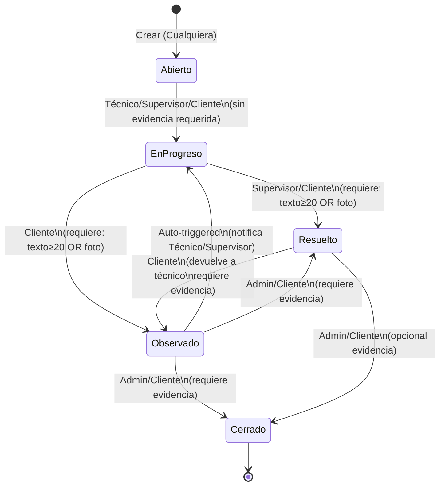
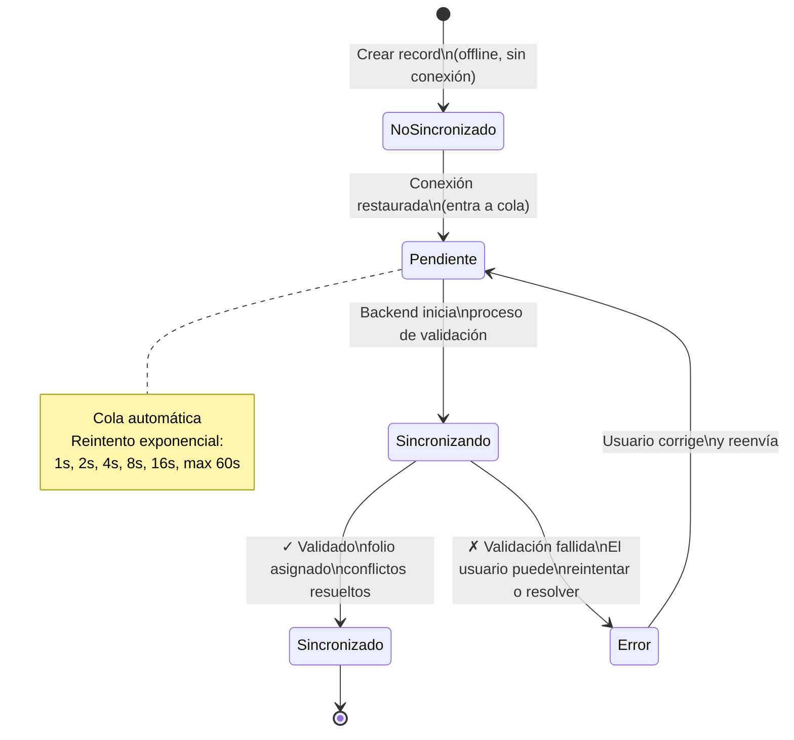

# FASE 1 — REGLAS DE NEGOCIO DETALLADO
## CMMS HVAC PRO — Sistema de Gestión de Mantenimiento

**Versión:** 1.0  
**Fecha:** 2026-06-13  
**Estado:** Validado y Listo para Desarrollo  
**Nivel:** Arquitecto + Detallado (Pseudocódigo, Ejemplos, Edge Cases, Performance)

---

## TABLA DE CONTENIDOS

1. [Meta del Documento](#meta)
2. [Entidades y Modelo de Datos](#entidades)
3. [Máquinas de Estado](#máquinas-estado)
4. [Validaciones y Restricciones](#validaciones)
5. [Cálculos y Derivadas](#cálculos)
6. [Permisos y Control de Acceso](#permisos)
7. [Comportamiento Offline/Online](#offline-online)
8. [Eventos y Notificaciones](#eventos)
9. [Conflictos y Resolución](#conflictos)
10. [Integridad de Datos](#integridad)
11. [Casos de Uso Detallados](#casos-uso)
12. [Consideraciones Técnicas](#técnicas)
13. [Edge Cases](#edge-cases)
14. [Performance y Límites](#performance)
15. [Datos Maestros y Catálogos](#datos-maestros)

---

## 1. META DEL DOCUMENTO {#meta}

**Propósito:** Especificación completa de reglas de negocio para Fase 1 del CMMS HVAC PRO, con suficiente detalle para que desarrolladores backend y frontend implementen sin ambigüedades.

**Audiencia:** Arquitectos, Desarrolladores, QA, Product Owners

**Scope:** Módulos principales de Fase 1:
- Control de Acceso (6 roles)
- Ficha Técnica HVAC (identificación, especificaciones, ciclo vida)
- Tickets & Incidencias (workflow Abierto→Cerrado)
- Órdenes de Trabajo (OT) — integración con form_instances
- Mi Compañía (documentos corporativos)
- Indicadores (KPI, alertas, consumo energético)
- Exportación y Sincronización

**No incluye Fase 1:**
- Formularios dinámicos (form_templates/instances) — cubierto en arquitectura
- Mantenimiento Preventivo avanzado — Fase 2+3
- Inventario UI — solo DDL documentado
- Módulos aislados (Python termodinámico, WhatsApp) — documentados para después

---

## 2. ENTIDADES Y MODELO DE DATOS {#entidades}

### 2.1 Jerarquía de Tenancy

```
cliente_id (Tenant raíz)
├── sucursal_id
│   ├── tag_id (Equipo/Asset)
│   ├── work_order_id (OT)
│   ├── ticket_id (Incidencia)
│   └── inventory_item_id (Stock — sin UI Fase 1)
├── user_id (Usuario del cliente)
└── catalog_asset_types_id (Tipos de equipo)
```

**Regla crítica:** TODO registro debe llevar `cliente_id`. Sin excepción.

```sql
-- Ejemplo: Crear equipo en sucursal
INSERT INTO equipos (
  cliente_id,  -- OBLIGATORIO
  sucursal_id,
  tag,
  nombre,
  ...
) VALUES (...)
```

### 2.2 Entidades Principales

#### **RN-ENT-01 — Cliente**

```sql
CREATE TABLE clientes (
  cliente_id UUID PRIMARY KEY,
  nombre VARCHAR(255) NOT NULL,
  rut VARCHAR(12) NOT NULL UNIQUE,
  razon_social VARCHAR(255),
  direccion_sede VARCHAR(500),
  telefono VARCHAR(20),
  email VARCHAR(255),
  sitio_web VARCHAR(255),
  moneda ENUM('CLP', 'USD') DEFAULT 'CLP',
  logo_url VARCHAR(500),  -- PNG/SVG
  estado ENUM('activo', 'suspendido', 'cerrado') DEFAULT 'activo',
  created_at TIMESTAMP,
  updated_at TIMESTAMP,
  updated_by_user_id UUID  -- Quién editó por última vez
);
```

**Invariantes:**
- RUT único y formato válido (XX.XXX.XXX-X)
- nombre no vacío (mín 3 caracteres)
- email formato válido si presente
- estado cambios: activo → suspendido → cerrado (no reversible)

**Editable por:** Programador, Admin (su cliente)

**Nota:** Cliente borrado marca como "cerrado", no se elimina (auditoría).

---

#### **RN-ENT-02 — Sucursal**

```sql
CREATE TABLE sucursales (
  sucursal_id UUID PRIMARY KEY,
  cliente_id UUID NOT NULL REFERENCES clientes(cliente_id),
  nombre VARCHAR(255) NOT NULL,
  codigo VARCHAR(50) NOT NULL,  -- Para TAG: {codigo}.{tipo}.{seq}
  direccion VARCHAR(500),
  ciudad VARCHAR(100),
  region VARCHAR(100),
  telefono VARCHAR(20),
  email VARCHAR(255),
  latitud DECIMAL(10, 8),
  longitud DECIMAL(11, 8),
  codigo_num INT NOT NULL,  -- Correlativo para RN-ACT-06 (tag canónico)
  estado ENUM('activo', 'cerrado') DEFAULT 'activo',
  created_at TIMESTAMP,
  updated_at TIMESTAMP,
  UNIQUE(cliente_id, nombre),
  UNIQUE(cliente_id, codigo),
  UNIQUE(cliente_id, codigo_num)
);
```

**Invariantes:**
- `cliente_id + nombre` único (no duplicar sucursales por cliente)
- `codigo` usado para generar TAG (ej: "21-STK" → sucursal 21 de Santiago)
- `codigo_num` es número correlativo (1, 2, 3...) para RN-ACT-06

**Editable por:** Programador, Admin (su cliente)

---

#### **RN-ENT-03 — Tipo de Equipo**

```sql
CREATE TABLE catalog_asset_types (
  tipo_de_equipo_id UUID PRIMARY KEY,
  cliente_id UUID NOT NULL REFERENCES clientes(cliente_id),
  nombre VARCHAR(100) NOT NULL,
  descripcion TEXT,
  codigo_num INT NOT NULL,  -- Correlativo para TAG
  campos_dinamicos JSONB,   -- Campos extras específicos del tipo
  categoria VARCHAR(50),    -- "HVAC", "Electricidad", etc.
  es_predefinido BOOLEAN DEFAULT FALSE,  -- Tipo de sistema vs custom cliente
  estado ENUM('activo', 'archivado') DEFAULT 'activo',
  created_at TIMESTAMP,
  updated_at TIMESTAMP,
  UNIQUE(cliente_id, nombre)
);
```

**Ejemplos de tipos:**
- Split, Central/Ducted, Chiller, VRF, Aire Acondicionado Portátil, Equipo de Precisión, etc.

**Campos dinámicos por tipo (JSONB):**
```json
{
  "Split": {
    "campos": ["capacidad_btu", "voltaje"]
  },
  "Chiller": {
    "campos": ["capacidad_tr", "bombas", "circuito_hidraulico"]
  },
  "VRF": {
    "campos": ["ue_count", "ue_details"]
  }
}
```

**Editable por:** Programador, Admin (su cliente)  
**Extensible:** Sí, cliente puede agregar tipos custom

---

#### **RN-ENT-04 — Equipo (Asset/Tag)**

```sql
CREATE TABLE equipos (
  tag VARCHAR(100) PRIMARY KEY,  -- {sucursal_codigo}.{tipo_codigo}.{seq}
  cliente_id UUID NOT NULL REFERENCES clientes(cliente_id),
  sucursal_id UUID NOT NULL REFERENCES sucursales(sucursal_id),
  tipo_de_equipo_id UUID NOT NULL REFERENCES catalog_asset_types(tipo_de_equipo_id),
  
  -- Identificación
  nombre VARCHAR(255) NOT NULL,
  marca VARCHAR(100),
  modelo VARCHAR(100),
  serie VARCHAR(100) UNIQUE,
  
  -- Especificaciones técnicas
  refrigerante_id UUID REFERENCES refrigerantes_catalogo(refrigerante_id),
  capacidad_valor DECIMAL(10, 2),
  capacidad_unidad ENUM('BTU', 'kW', 'TR') DEFAULT 'BTU',
  voltaje VARCHAR(50),  -- Ej: "220V", "380/400V 3x"
  corriente_nominal DECIMAL(10, 2),  -- Amperios
  potencia_kw DECIMAL(10, 2),
  
  -- Compresor (por circuito — ver tabla trabajo_order_assets)
  -- Campos dinámicos según tipo_de_equipo_id
  variables_dinamicas JSONB,  -- Capacidad BTU, circuitos, etc.
  
  -- Ciclo de vida
  fecha_instalacion DATE,
  vida_util_anos INT,  -- Años esperados
  frecuencia_mantenimiento ENUM(
    'unico', 'mensual', 'bimestral', 'trimestral', 'semestral', 'anual'
  ),
  
  -- Estado
  criticidad ENUM('redundante', 'no_critico', 'critico') DEFAULT 'no_critico',
  estado ENUM(
    'operativo', 'en_observacion', 'en_falla', 'mantenimiento', 'retirado'
  ) DEFAULT 'operativo',
  
  -- Ubicación & Contacto
  ubicacion VARCHAR(500),
  area VARCHAR(100),
  region VARCHAR(100),
  responsable_interno VARCHAR(100),
  
  -- Campos personalizables por cliente
  costo_compra DECIMAL(15, 2),
  proveedor VARCHAR(100),
  garantia_anos INT,
  
  -- Imagen placa
  imagen_placa_url VARCHAR(500),
  tiene_placa BOOLEAN DEFAULT TRUE,
  
  -- Auditoría
  created_at TIMESTAMP,
  updated_at TIMESTAMP,
  created_by_user_id UUID,
  
  UNIQUE(cliente_id, tag),
  CHECK (fecha_instalacion <= NOW()),
  CHECK (vida_util_anos > 0),
  CHECK (costo_compra >= 0)
);
```

**Invariantes:**

1. **TAG único por cliente**
   ```sql
   {sucursal_codigo}.{tipo_codigo}.{seq}
   Ej: 21-STK.AC.001
   ```
   - Generado automático al crear
   - No editable después
   - Único en toda la plataforma (por cliente)

2. **Serie única por equipo**
   - Si no tiene, permitir NULL

3. **Fecha instalación ≤ hoy**
   - Validar en cliente (datepicker) y servidor

4. **Vida útil > 0**
   - Mínimo 1 año

5. **Imagen placa**
   - Obligatoria UNLESS checkbox "No tiene placa"
   - Si tiene placa: campo URL no puede estar vacío

**Estados y transiciones:**
```
Operativo ↔ En Observación ↔ En Falla ↔ Mantenimiento → Retirado (fin)
```

**Editable por:**
- Crear: Admin, Supervisor, Técnico (su sucursal), Cliente (No)
- Editar: Admin, Supervisor, Técnico (excepto Cliente)
- Retirar: Solo Admin

**Campos no editables después de crear:**
- tag
- tipo_de_equipo_id
- cliente_id
- sucursal_id

---

#### **RN-ENT-05 — Ficha Técnica (Extensión de Equipo)**

NO es tabla separada. Los datos están en `equipos` + `variables_dinamicas` (JSONB).

**Dinámicas según tipo:**

**Split:**
```json
{
  "tipo_split": "mural | cassette | piso-techo",
  "capacidad_btu": 12000,
  "unidad_interior": "1",
  "ciclo_frio_calor": true,
  "compresor": {
    "tipo": "scroll | rotativo | piston",
    "on_off": true,
    "inverter": false
  }
}
```

**Chiller:**
```json
{
  "capacidad_tr": 5,
  "bombas": [
    {"nombre": "Primaria", "tipo": "centrifuga", "caudal_gpm": 50},
    {"nombre": "Secundaria", "tipo": "centrifuga", "caudal_gpm": 50}
  ],
  "circuitos": [
    {"numero": 1, "compresores": 2, "refrigerante": "R-410A"}
  ]
}
```

**VRF:**
```json
{
  "capacidad_total_kw": 20,
  "ue_list": [
    {"id": "UE-001", "ubicacion": "Oficina 1", "capacidad_kw": 2.5},
    {"id": "UE-002", "ubicacion": "Oficina 2", "capacidad_kw": 2.5}
  ]
}
```

---

#### **RN-ENT-06 — Orden de Trabajo (OT)**

```sql
CREATE TABLE work_orders (
  work_order_id UUID PRIMARY KEY,
  cliente_id UUID NOT NULL REFERENCES clientes(cliente_id),
  sucursal_id UUID NOT NULL REFERENCES sucursales(sucursal_id),
  
  -- Folio
  folio VARCHAR(50),  -- INF-{cod_sucursal}.{cod_tipo}-{tag_corr}-{seq}
  folio_temporal VARCHAR(50),  -- Offline: OT-{uuid-corto}
  
  -- Tipo y estado
  tipo ENUM(
    'preventivo', 'correctivo', 'atencion_falla', 'puesta_en_marcha',
    'inspeccion_tecnica', 'instalacion_montaje', 'predictivo'
  ) NOT NULL,
  estado ENUM(
    'abierto', 'en_progreso', 'completado', 'cerrado'
  ) DEFAULT 'abierto',
  
  -- Contenido
  descripcion TEXT,
  tecnico_asignado_user_id UUID REFERENCES users(user_id),
  supervisor_user_id UUID REFERENCES users(user_id),
  
  -- Narrativos (se auto-pueblan vía binding)
  hallazgo TEXT,
  diagnostico TEXT,
  recomendaciones TEXT,
  conclusiones TEXT,
  
  -- Control
  version INT DEFAULT 1,  -- Incrementa cada edición
  created_at TIMESTAMP,
  updated_at TIMESTAMP,
  created_by_user_id UUID,
  closed_at TIMESTAMP,
  
  UNIQUE(cliente_id, folio),  -- Folio único por cliente
  CHECK (estado IN ('abierto', 'en_progreso', 'completado', 'cerrado'))
);
```

**Nota crítica:** NO hay `asset_id` directo. Las OT se vinculan a N equipos vía tabla `work_order_assets`.

---

#### **RN-ENT-07 — Work Order Assets (Vinculación OT ↔ N Equipos)**

```sql
CREATE TABLE work_order_assets (
  work_order_asset_id UUID PRIMARY KEY,
  work_order_id UUID NOT NULL REFERENCES work_orders(work_order_id),
  cliente_id UUID NOT NULL REFERENCES clientes(cliente_id),
  tag VARCHAR(100) NOT NULL REFERENCES equipos(tag),
  
  -- Estado por tag
  estado ENUM(
    'pendiente', 'en_progreso', 'completado'
  ) DEFAULT 'pendiente',
  
  -- Referencia a form_instance (informe por tag)
  form_instance_id UUID,  -- Vinculado en Fase 2
  
  -- Orden dentro de OT
  orden INT,
  
  created_at TIMESTAMP,
  updated_at TIMESTAMP,
  
  UNIQUE(work_order_id, tag),
  FOREIGN KEY (cliente_id, tag) REFERENCES equipos(cliente_id, tag)
);
```

**Regla:** OT cierra solo cuando TODOS los work_order_assets están en `completado`.

```sql
-- Trigger: Validar OT.estado = 'completado'
BEFORE UPDATE ON work_orders
FOR EACH ROW
WHEN NEW.estado = 'completado'
BEGIN
  SELECT COUNT(*) FROM work_order_assets
  WHERE work_order_id = NEW.work_order_id
  AND estado != 'completado';
  
  IF COUNT > 0 THEN
    RAISE EXCEPTION 'No todos los equipos están completados';
  END IF;
END;
```

---

#### **RN-ENT-08 — Ticket (Incidencia)**

```sql
CREATE TABLE tickets (
  ticket_id UUID PRIMARY KEY,
  cliente_id UUID NOT NULL REFERENCES clientes(cliente_id),
  sucursal_id UUID NOT NULL REFERENCES sucursales(sucursal_id),
  
  -- Identificación
  numero_correlativo INT NOT NULL,  -- Secuencial por cliente
  titulo VARCHAR(255) NOT NULL,
  descripcion TEXT NOT NULL,
  
  -- Clasificación
  tipo ENUM('correctivo', 'preventivo', 'consulta') DEFAULT 'correctivo',
  prioridad ENUM('baja', 'media', 'alta', 'critica') DEFAULT 'media',
  
  -- Equipos asociados
  tag VARCHAR(100) REFERENCES equipos(tag),  -- Opcional
  
  -- Asignación
  responsable_tecnico_user_id UUID REFERENCES users(user_id),
  proveedor_asignado_user_id UUID REFERENCES users(user_id),
  
  -- Estado
  estado ENUM(
    'abierto', 'en_progreso', 'observado', 'resuelto', 'cerrado'
  ) DEFAULT 'abierto',
  
  -- Auditoría
  creador_user_id UUID NOT NULL REFERENCES users(user_id),
  created_at TIMESTAMP,
  updated_at TIMESTAMP,
  closed_at TIMESTAMP,
  
  UNIQUE(cliente_id, numero_correlativo),
  CHECK (titulo != '' AND LENGTH(titulo) >= 5),
  CHECK (descripcion != '' AND LENGTH(descripcion) >= 10)
);
```

---

#### **RN-ENT-09 — Ticket Comments (Historial + Evidencia)**

```sql
CREATE TABLE ticket_comments (
  ticket_comment_id UUID PRIMARY KEY,
  ticket_id UUID NOT NULL REFERENCES tickets(ticket_id),
  
  -- Cambio de estado
  estado_anterior ENUM('abierto', 'en_progreso', 'observado', 'resuelto', 'cerrado'),
  estado_nuevo ENUM('abierto', 'en_progreso', 'observado', 'resuelto', 'cerrado'),
  
  -- Evidencia
  texto TEXT,  -- Mínimo 20 caracteres si presente
  foto_url VARCHAR(500),
  
  -- Auditoría
  creador_user_id UUID NOT NULL REFERENCES users(user_id),
  created_at TIMESTAMP,
  
  CHECK (
    (texto IS NOT NULL AND LENGTH(texto) >= 20) OR
    (foto_url IS NOT NULL)
  )
);
```

**Regla:** Al cambiar estado de ticket, OBLIGATORIO agregar comentario con:
- Texto (≥20 caracteres) O Foto
- Ambos opcionales pero al menos uno requerido

---

#### **RN-ENT-10 — Indicadores (KPI)**

NO es tabla separada. Se calculan ON-DEMAND a partir de OT, Tickets, Equipos.

```sql
-- Ejemplo de vista materializada (calculada nightly)
CREATE MATERIALIZED VIEW kpi_cliente_mes AS
SELECT
  cliente_id,
  DATE_TRUNC('month', created_at) AS mes,
  
  -- MTBF
  EXTRACT(EPOCH FROM (MAX(created_at) - MIN(created_at))) / 3600 / 
    (COUNT(CASE WHEN tipo = 'correctivo' THEN 1 END) + 1) AS mtbf_horas,
  
  -- MTBR
  AVG(EXTRACT(EPOCH FROM (closed_at - created_at))) / 3600 AS mtbr_horas,
  
  -- Disponibilidad (%)
  (1 - SUM(EXTRACT(EPOCH FROM (closed_at - created_at))) / 
    (30 * 24 * 3600)) * 100 AS disponibilidad_pct,
  
  -- Consumo energético (kWh)
  SUM(COALESCE(consumo_kwh, 0)) AS consumo_kwh_total
  
FROM work_orders
GROUP BY cliente_id, DATE_TRUNC('month', created_at);
```

**Cálculo de Consumo Energético:**

```sql
-- Por equipo, en OT cerrada
SELECT
  equipos.tag,
  equipos.voltaje,
  equipos.corriente_nominal,
  ticket_comments.fecha_medicion,
  
  -- kWh = Voltaje × Corriente × Horas / 1000
  (
    CASE 
      WHEN equipos.voltaje LIKE '%3x%' THEN 3 * 220 * equipos.corriente_nominal
      ELSE 220 * equipos.corriente_nominal
    END
  ) * (EXTRACT(EPOCH FROM (work_orders.closed_at - work_orders.created_at)) / 3600) / 1000
  AS kwh_calculado
  
FROM work_orders
JOIN work_order_assets ON work_orders.work_order_id = work_order_assets.work_order_id
JOIN equipos ON work_order_assets.tag = equipos.tag
LEFT JOIN ticket_comments ON ... -- Mediciones registradas
WHERE work_orders.estado = 'cerrado';
```

**Editable:** Campo `consumo_kwh` puede ser:
1. Auto-calculado (fórmula arriba)
2. Sobreescrito manualmente por usuario

```sql
ALTER TABLE work_orders ADD COLUMN (
  consumo_kwh DECIMAL(10, 2),  -- NULL = usar fórmula; valor = usar manual
  consumo_editado_manually BOOLEAN DEFAULT FALSE
);
```

---

### 2.3 Tablas de Configuración & Catálogos

#### **Refrigerantes Catálogo**

```sql
CREATE TABLE refrigerantes_catalogo (
  refrigerante_id UUID PRIMARY KEY,
  nombre VARCHAR(50) NOT NULL UNIQUE,  -- R-410A, R-407C, etc.
  presion_sat_psi DECIMAL(8, 2),
  temp_sat_celsius DECIMAL(5, 2),
  peligro_nivel ENUM('bajo', 'medio', 'alto') DEFAULT 'medio',
  disponible_chile BOOLEAN DEFAULT TRUE,
  creado_en DATE DEFAULT NOW()
);
```

**Datos iniciales (15 refrigerantes usados en Chile):**
```
R-22, R-410A, R-407C, R-407F, R-290 (Propano), R-600a (Isobutano),
R-32, R-454B, R-513A, R-1234yf, R-1234ze, R-744 (CO2), R-717 (Amoníaco),
R-421A, R-422D
```

---

#### **Catálogo Estados & Transiciones**

```sql
CREATE TABLE estado_transiciones (
  from_estado VARCHAR(50),
  to_estado VARCHAR(50),
  roles_permitidos TEXT[],  -- {'Técnico', 'Supervisor', 'Admin'}
  requiere_evidencia BOOLEAN,
  PRIMARY KEY (from_estado, to_estado)
);
```

**Ejemplo:**
```
| from        | to        | roles permitidos        | evidencia |
|-------------|-----------|------------------------|-----------|
| abierto     | progreso  | {Técnico, Supervisor}   | no        |
| progreso    | resuelto  | {Supervisor, Cliente}   | sí (txt≥20 O foto) |
| resuelto    | observado | {Cliente}               | sí (txt≥20 O foto) |
| observado   | resuelto  | {Admin, Cliente}        | sí (txt≥20 O foto) |
```

---

## 3. MÁQUINAS DE ESTADO {#máquinas-estado}

### 3.1 Workflow Ticket



**Estados inmutables una vez en Cerrado:**
- No se puede reapertar
- Historial completo guardado
- Auditoría: quién cerró, cuándo, por qué

---

### 3.2 Workflow OT (Orden de Trabajo)

```mermaid
stateDiagram-v2
    [*] --> Abierto: Crear OT\n(Técnico/Supervisor/Cliente)
    
    Abierto --> EnProgreso: Asignar técnico\n(Supervisor/Admin)
    
    EnProgreso --> Completado: Todos los equipos\n(work_order_assets)\ncompletados\n+ Informe firmado
    
    Completado --> Cerrado: Supervisor/Admin\n(validación final)
    
    Cerrado --> [*]
    
    Abierto -.->|Sin cambios| Abierto: Puede editarse\n(descripción, técnico)
```

**Regla crítica:** OT NO puede pasar a Completado si:
- Hay work_order_assets con estado ≠ 'completado'
- No hay informe (form_instance) para cada asset
- Informe no está firmado

```sql
-- Validación antes de permitir Completado
BEFORE UPDATE ON work_orders
FOR EACH ROW
WHEN NEW.estado = 'completado'
DECLARE
  pending_count INT;
  missing_signatures INT;
BEGIN
  -- Verificar equipos completados
  SELECT COUNT(*) INTO pending_count
  FROM work_order_assets woa
  WHERE woa.work_order_id = NEW.work_order_id
  AND woa.estado != 'completado';
  
  IF pending_count > 0 THEN
    RAISE EXCEPTION 'OT-VAL-001: Hay % equipos sin completar', pending_count;
  END IF;
  
  -- Verificar firmas (verificado en form_instances)
  SELECT COUNT(*) INTO missing_signatures
  FROM work_order_assets woa
  LEFT JOIN form_instances fi ON woa.form_instance_id = fi.form_instance_id
  WHERE woa.work_order_id = NEW.work_order_id
  AND (fi.estado != 'firmado' OR fi.firma_digital IS NULL);
  
  IF missing_signatures > 0 THEN
    RAISE EXCEPTION 'OT-VAL-002: Hay % informes sin firmar', missing_signatures;
  END IF;
END;
```

---

### 3.3 Sincronización Offline (Estado Interno)



---

## 4. VALIDACIONES Y RESTRICCIONES {#validaciones}

### 4.1 Validaciones de Equipo

#### **RN-VAL-EQUIPO-01 — TAG Único e Inmutable**

```javascript
// Frontend: Al crear equipo
function generarTAG(sucursal_codigo, tipo_codigo, seq) {
  // Formato: {sucursal_codigo}.{tipo_codigo}.{seq}
  // Ej: 21-STK.AC.001
  
  if (!sucursal_codigo || !tipo_codigo || !seq) {
    throw new ValidationError('Faltan parámetros para TAG');
  }
  
  const tag = `${sucursal_codigo}.${tipo_codigo}.${String(seq).padStart(3, '0')}`;
  
  // Validar contra backend
  const exists = await checkTAGExists(tag);
  if (exists) {
    throw new ValidationError(`TAG ${tag} ya existe`);
  }
  
  return tag;
}

// Backend: Al guardar
function validateTAGOnSave(equipo) {
  const tag = equipo.tag;
  
  // Validar formato regex
  if (!/^\d{2,}-[A-Z]+\.[A-Z]+\.\d{3}$/.test(tag)) {
    throw new ValidationError('Formato TAG inválido');
  }
  
  // Validar unicidad por cliente
  const existing = db.query(
    'SELECT 1 FROM equipos WHERE cliente_id = ? AND tag = ?',
    [equipo.cliente_id, tag]
  );
  
  if (existing.length > 0) {
    throw new ValidationError('TAG duplicado en cliente');
  }
  
  return true;
}
```

#### **RN-VAL-EQUIPO-02 — Imagen Placa Requerida (Condicional)**

```javascript
function validateImagenPlaca(equipo) {
  // Si tiene_placa = true, imagen_placa_url debe estar presente
  if (equipo.tiene_placa && !equipo.imagen_placa_url) {
    throw new ValidationError(
      'Si el equipo tiene placa, debe adjuntar imagen'
    );
  }
  
  // Si tiene_placa = false, imagen_placa_url puede ser NULL
  if (!equipo.tiene_placa && equipo.imagen_placa_url) {
    console.warn('Imagen ignorada: equipo marcado sin placa');
  }
  
  // Validar URL si presente
  if (equipo.imagen_placa_url) {
    const isValidURL = /^https?:\/\/.+\.(jpg|png|jpeg)$/i.test(
      equipo.imagen_placa_url
    );
    if (!isValidURL) {
      throw new ValidationError('URL imagen inválida (solo JPG/PNG)');
    }
  }
}
```

#### **RN-VAL-EQUIPO-03 — Campos Dinámicos Según Tipo**

```javascript
function validateDinámicos(equipo, tipo_de_equipo) {
  const requeridos = tipo_de_equipo.campos_dinamicos?.requeridos || [];
  
  requeridos.forEach(campo => {
    if (!equipo.variables_dinamicas[campo]) {
      throw new ValidationError(
        `Campo requerido para ${tipo_de_equipo.nombre}: ${campo}`
      );
    }
  });
  
  // Ejemplo: Split requiere capacidad_btu
  if (tipo_de_equipo.nombre === 'Split') {
    if (!equipo.variables_dinamicas.capacidad_btu || 
        equipo.variables_dinamicas.capacidad_btu <= 0) {
      throw new ValidationError('Capacidad BTU requerida para Split');
    }
  }
  
  // Ejemplo: VRF requiere mínimo 1 UE
  if (tipo_de_equipo.nombre === 'VRF') {
    const ue_list = equipo.variables_dinamicas.ue_list || [];
    if (ue_list.length === 0) {
      throw new ValidationError('VRF requiere al menos 1 Unidad Evaporadora');
    }
  }
}
```

#### **RN-VAL-EQUIPO-04 — Cambios de Estado Válidos**

```javascript
function validateEstadoTransicion(equipo_anterior, equipo_nuevo) {
  const estado_actual = equipo_anterior.estado;
  const estado_nuevo = equipo_nuevo.estado;
  
  const transiciones_validas = {
    'operativo': ['en_observacion', 'en_falla', 'mantenimiento', 'retirado'],
    'en_observacion': ['operativo', 'en_falla', 'mantenimiento', 'retirado'],
    'en_falla': ['operativo', 'mantenimiento', 'retirado'],
    'mantenimiento': ['operativo', 'en_observacion', 'en_falla', 'retirado'],
    'retirado': []  // Ninguna transición desde retirado
  };
  
  if (!transiciones_validas[estado_actual]?.includes(estado_nuevo)) {
    throw new ValidationError(
      `No se puede pasar de ${estado_actual} a ${estado_nuevo}`
    );
  }
  
  // Retirado es irreversible
  if (estado_nuevo === 'retirado') {
    console.warn('Equipo marcado como retirado. No se puede revertir.');
  }
  
  return true;
}
```

---

### 4.2 Validaciones de Ticket

#### **RN-VAL-TICKET-01 — Evidencia en Transiciones**

```javascript
function validateEvidenciaEnTransicion(
  ticket_anterior,
  ticket_nuevo,
  comentario
) {
  const requiere_evidencia = {
    'abierto_progreso': false,
    'progreso_resuelto': true,
    'progreso_observado': true,
    'resuelto_observado': true,
    'observado_resuelto': true,
    'observado_cerrado': true,
    'resuelto_cerrado': false  // Opcional
  };
  
  const transicion = `${ticket_anterior.estado}_${ticket_nuevo.estado}`;
  const si_requiere = requiere_evidencia[transicion];
  
  if (si_requiere) {
    const tiene_texto = comentario.texto && 
                        comentario.texto.length >= 20;
    const tiene_foto = comentario.foto_url;
    
    if (!tiene_texto && !tiene_foto) {
      throw new ValidationError(
        'Esta transición requiere texto (≥20 caracteres) O foto'
      );
    }
  }
  
  return true;
}
```

#### **RN-VAL-TICKET-02 — Ciclo de Devueltas (No Infinito)**

```javascript
function validateCiclosDevueltas(ticket) {
  // Contar transiciones Observado en últimas 7 días
  const devueltas_ultima_semana = db.query(`
    SELECT COUNT(*) FROM ticket_comments
    WHERE ticket_id = ?
    AND estado_nuevo = 'observado'
    AND created_at > NOW() - INTERVAL '7 days'
  `, [ticket.ticket_id]);
  
  const MAX_DEVUELTAS_POR_SEMANA = 5;
  
  if (devueltas_ultima_semana[0].count >= MAX_DEVUELTAS_POR_SEMANA) {
    throw new ValidationError(
      `Máximo ${MAX_DEVUELTAS_POR_SEMANA} devueltas por semana. ` +
      `Escalar a Supervisor.`
    );
  }
  
  return true;
}
```

---

### 4.3 Validaciones de OT

#### **RN-VAL-OT-01 — No puede crearse OT sin Equipo**

```javascript
function validateOTCreacion(ot_data) {
  if (!ot_data.equipos || ot_data.equipos.length === 0) {
    throw new ValidationError('OT requiere al menos 1 equipo');
  }
  
  // Validar que todos los equipos existan y pertenezcan al cliente
  ot_data.equipos.forEach(tag => {
    const equipo = db.query(
      'SELECT 1 FROM equipos WHERE tag = ? AND cliente_id = ?',
      [tag, ot_data.cliente_id]
    );
    
    if (equipo.length === 0) {
      throw new ValidationError(`Equipo ${tag} no existe o no pertenece al cliente`);
    }
  });
  
  return true;
}
```

#### **RN-VAL-OT-02 — Cambios permitidos en estado Abierto solamente**

```javascript
function validateOTEditabilidad(ot_antigua, ot_nueva) {
  if (ot_antigua.estado !== 'abierto') {
    // En otros estados, solo cambios limitados permitidos
    const cambios_permitidos = [
      'tecnico_asignado_user_id',  // Reasignar técnico
      'supervisor_user_id'         // Reasignar supervisor
    ];
    
    const cambios_realizados = Object.keys(ot_antigua)
      .filter(key => ot_antigua[key] !== ot_nueva[key]);
    
    const cambios_no_permitidos = cambios_realizados
      .filter(c => !cambios_permitidos.includes(c));
    
    if (cambios_no_permitidos.length > 0) {
      throw new ValidationError(
        `OT en estado ${ot_antigua.estado} no se puede editar. ` +
        `Solo se permite reasignar técnico/supervisor.`
      );
    }
  }
  
  return true;
}
```

---

## 5. CÁLCULOS Y DERIVADAS {#cálculos}

### 5.1 MTBF (Mean Time Between Failures)

**Definición:** Tiempo promedio entre fallas. Indica confiabilidad del equipo.

**Fórmula:**
```
MTBF = Horas totales operación / Número de fallas correctivas
```

**Cálculo:**

```sql
-- Por equipo, últimos 12 meses
SELECT
  equipos.tag,
  equipos.nombre,
  
  -- Horas operación = suma de duración OT
  COALESCE(
    SUM(EXTRACT(EPOCH FROM (work_orders.closed_at - work_orders.created_at)) / 3600),
    0
  ) AS horas_totales,
  
  -- Fallas = OT tipo 'correctivo' O 'atencion_falla'
  COUNT(CASE WHEN work_orders.tipo IN ('correctivo', 'atencion_falla') THEN 1 END)
    AS num_fallas,
  
  -- MTBF
  COALESCE(
    SUM(EXTRACT(EPOCH FROM (work_orders.closed_at - work_orders.created_at)) / 3600) /
    NULLIF(COUNT(CASE WHEN work_orders.tipo IN ('correctivo', 'atencion_falla') THEN 1 END), 0),
    0
  ) AS mtbf_horas
  
FROM equipos
LEFT JOIN work_order_assets ON equipos.tag = work_order_assets.tag
LEFT JOIN work_orders ON work_order_assets.work_order_id = work_orders.work_order_id
WHERE equipos.cliente_id = ? 
  AND work_orders.created_at >= NOW() - INTERVAL '12 months'
  AND work_orders.estado = 'cerrado'
GROUP BY equipos.tag, equipos.nombre
ORDER BY mtbf_horas DESC;
```

**Edge cases:**
- Si 0 fallas → MTBF = ∞ (mostrar como "N/A" o "Excelente")
- Si horas_totales = 0 → MTBF = 0 (equipo nunca operó)

**Actualización:** Nightly (2 AM) vía job programado

```javascript
// Job: Calcular MTBF diariamente
cron('0 2 * * *', async () => {
  const clientes = await db.query('SELECT DISTINCT cliente_id FROM equipos');
  
  for (const cliente of clientes) {
    const resultado = await calcularMTBF(cliente.cliente_id);
    await guardarEnCache(
      `mtbf:${cliente.cliente_id}:mes`,
      resultado,
      TTL_24H
    );
  }
});
```

---

### 5.2 MTBM (Mean Time Between Maintenance)

**Definición:** Tiempo promedio entre mantenimientos preventivos.

**Fórmula:**
```
MTBM = Horas totales operación / Número de mantenimientos preventivos
```

```sql
SELECT
  equipos.tag,
  SUM(EXTRACT(EPOCH FROM (work_orders.closed_at - work_orders.created_at)) / 3600)
    AS horas_totales,
  COUNT(CASE WHEN work_orders.tipo = 'preventivo' THEN 1 END)
    AS num_mantenimientos,
  
  COALESCE(
    SUM(...) / NULLIF(COUNT(CASE WHEN work_orders.tipo = 'preventivo' THEN 1 END), 0),
    0
  ) AS mtbm_horas
  
FROM equipos
LEFT JOIN work_order_assets ON equipos.tag = work_order_assets.tag
LEFT JOIN work_orders ON work_order_assets.work_order_id = work_orders.work_order_id
WHERE equipos.cliente_id = ?
  AND work_orders.estado = 'cerrado'
  AND work_orders.created_at >= NOW() - INTERVAL '12 months'
GROUP BY equipos.tag;
```

---

### 5.3 MTBR (Mean Time to Repair)

**Definición:** Tiempo promedio de reparación (tiempo inactivo).

**Fórmula:**
```
MTBR = Σ Duración reparaciones / Número de reparaciones
```

```sql
SELECT
  equipos.tag,
  
  -- Suma de horas de reparación (OT tipo correctivo)
  AVG(EXTRACT(EPOCH FROM (work_orders.closed_at - work_orders.created_at)) / 3600)
    FILTER (WHERE work_orders.tipo IN ('correctivo', 'atencion_falla'))
    AS mtbr_horas_promedio,
  
  -- Máximo tiempo reparación
  MAX(EXTRACT(EPOCH FROM (work_orders.closed_at - work_orders.created_at)) / 3600)
    FILTER (WHERE work_orders.tipo IN ('correctivo', 'atencion_falla'))
    AS mtbr_horas_max
    
FROM equipos
LEFT JOIN work_order_assets ON equipos.tag = work_order_assets.tag
LEFT JOIN work_orders ON work_order_assets.work_order_id = work_orders.work_order_id
WHERE equipos.cliente_id = ?
  AND work_orders.estado = 'cerrado'
  AND work_orders.created_at >= NOW() - INTERVAL '12 months'
GROUP BY equipos.tag;
```

---

### 5.4 Disponibilidad (%)

**Definición:** Porcentaje de tiempo que el equipo está operativo.

**Fórmula:**
```
Disponibilidad (%) = (Horas periodo - Horas inactivas) / Horas periodo × 100
```

```sql
SELECT
  equipos.tag,
  equipos.nombre,
  
  -- Horas en período (ej: mes actual)
  EXTRACT(EPOCH FROM (NOW() - DATE_TRUNC('month', NOW()))) / 3600
    AS horas_periodo,
  
  -- Horas inactivas = tiempo entre created_at y closed_at
  COALESCE(
    SUM(EXTRACT(EPOCH FROM (work_orders.closed_at - work_orders.created_at)) / 3600),
    0
  ) AS horas_inactivas,
  
  -- Disponibilidad
  ROUND(
    100 * (1 - COALESCE(SUM(...), 0) / 
           (EXTRACT(EPOCH FROM (NOW() - DATE_TRUNC('month', NOW()))) / 3600)),
    2
  ) AS disponibilidad_pct
  
FROM equipos
LEFT JOIN work_order_assets ON equipos.tag = work_order_assets.tag
LEFT JOIN work_orders ON work_order_assets.work_order_id = work_orders.work_order_id
WHERE equipos.cliente_id = ?
  AND work_orders.estado = 'cerrado'
  AND DATE_TRUNC('month', work_orders.created_at) = DATE_TRUNC('month', NOW())
GROUP BY equipos.tag, equipos.nombre;
```

**Edge case:** Si equipos.estado = 'retirado', excluir del cálculo

---

### 5.5 Consumo Energético (kWh)

**Origen de datos:** Manual (usuario edita) O Calculado

**Cálculo por defecto:**

```
kWh = (Voltaje × Corriente / 1000) × Horas operación

Para 3 fases:
kWh = (√3 × Voltaje × Corriente / 1000) × Horas operación
```

```javascript
function calcularConsumoKwh(equipo, horas_operacion) {
  // Si usuario editó manualmente, usar ese valor
  if (equipo.consumo_editado_manually && equipo.consumo_kwh) {
    return equipo.consumo_kwh;
  }
  
  // Si no, calcular
  const voltaje = parseFloat(equipo.voltaje);
  const corriente = equipo.corriente_nominal || 0;
  const es_trifasico = equipo.voltaje.includes('3x') || equipo.voltaje.includes('380');
  
  if (voltaje === 0 || corriente === 0) {
    return null;  // No se puede calcular
  }
  
  let potencia_kw;
  if (es_trifasico) {
    // √3 ≈ 1.732
    potencia_kw = (1.732 * voltaje * corriente) / 1000;
  } else {
    potencia_kw = (voltaje * corriente) / 1000;
  }
  
  const consumo_kwh = potencia_kw * horas_operacion;
  return Math.round(consumo_kwh * 100) / 100;  // Redondear a 2 decimales
}

// Ejemplo de uso
const equipo = {
  voltaje: '220V',      // Monofásico
  corriente_nominal: 10  // Amperios
};
const horas = 8;
const kwh = calcularConsumoKwh(equipo, horas);
// kwh = (220 × 10 / 1000) × 8 = 17.6 kWh

const equipo_3x = {
  voltaje: '380/400V 3x',  // Trifásico
  corriente_nominal: 15
};
const kwh_3x = calcularConsumoKwh(equipo_3x, horas);
// kwh = (1.732 × 380 × 15 / 1000) × 8 ≈ 64.6 kWh
```

**Almacenamiento:**

```sql
ALTER TABLE work_orders ADD COLUMN (
  consumo_kwh DECIMAL(10, 2),  -- NULL = usar fórmula, valor = manual
  consumo_editado_manually BOOLEAN DEFAULT FALSE,
  horas_operacion DECIMAL(8, 2)  -- Duración OT en horas
);

-- Trigger: Calcular consumo_kwh si no está seteado
BEFORE INSERT ON work_orders
FOR EACH ROW
BEGIN
  IF NEW.consumo_kwh IS NULL THEN
    NEW.consumo_kwh := calcularConsumoKwh(
      NEW.cliente_id,
      EXTRACT(EPOCH FROM (NEW.closed_at - NEW.created_at)) / 3600
    );
  END IF;
END;
```

---

### 5.6 OTPF (OT Primera Fez - OT Resueltas sin Devueltas)

**Definición:** % de OT que pasaron directamente de En Progreso → Resuelto sin estado Observado.

**Fórmula:**
```
OTPF (%) = OT sin Observado / Total OT Cerradas × 100
```

```sql
SELECT
  cliente_id,
  COUNT(*) FILTER (WHERE NOT EXISTS (
    SELECT 1 FROM ticket_comments
    WHERE ticket_id = tickets.ticket_id
    AND estado_nuevo = 'observado'
  )) :: FLOAT / COUNT(*) * 100 AS otpf_pct
  
FROM tickets
WHERE cliente_id = ?
  AND estado = 'cerrado'
  AND created_at >= NOW() - INTERVAL '30 days'
GROUP BY cliente_id;
```

---

### 5.7 Próximo Mantenimiento (Auto-calculado)

**Trigger:** Cada vez que OT con tipo='preventivo' se cierra

```sql
UPDATE equipos
SET 
  -- Último mantenimiento = fecha cierre OT más reciente
  (SELECT MAX(closed_at) FROM work_orders wo
   JOIN work_order_assets woa ON wo.work_order_id = woa.work_order_id
   WHERE woa.tag = equipos.tag AND wo.tipo = 'preventivo')
  
  -- Próximo = último + frecuencia
  DATEADD(
    CASE frecuencia_mantenimiento
      WHEN 'mensual' THEN MONTH, 1
      WHEN 'bimestral' THEN MONTH, 2
      WHEN 'trimestral' THEN MONTH, 3
      WHEN 'semestral' THEN MONTH, 6
      WHEN 'anual' THEN YEAR, 1
      WHEN 'unico' THEN NULL
    END
  )
  
WHERE tag = (SELECT DISTINCT tag FROM work_order_assets WHERE work_order_id = ?);
```

---

## 6. PERMISOS Y CONTROL DE ACCESO {#permisos}

### 6.1 Matriz Completa de Permisos

**Ver [FASE_1_ARQUITECTURA_Y_DISEÑO.md § 1.1](FASE_1_ARQUITECTURA_Y_DISEÑO.md#11-matriz-detallada-de-permisos)** para tabla completa.

### 6.2 Validación de Permisos en Código

#### **Pseudocódigo Backend: Middleware de Autenticación**

```javascript
// middleware/checkPermiso.js
function checkPermiso(accion, recurso) {
  return async (req, res, next) => {
    const { user } = req;  // JWT decoded
    const { cliente_id, sucursal_id, tag } = req.params;
    
    // Paso 1: Verificar que usuario pertenece al cliente
    if (!user.cliente_ids.includes(cliente_id)) {
      return res.status(403).json({ error: 'No tienes acceso a este cliente' });
    }
    
    // Paso 2: Cargar matriz de permisos
    const permisos = await cargarPermisosRol(user.role);
    
    // Paso 3: Validar acción
    if (!permisos[`${recurso}:${accion}`]) {
      return res.status(403).json({
        error: `Acción no permitida: ${recurso}:${accion}`,
        tu_rol: user.role
      });
    }
    
    // Paso 4: Validaciones adicionales por contexto
    if (accion === 'editar_equipo') {
      const equipo = await db.query(
        'SELECT * FROM equipos WHERE tag = ? AND cliente_id = ?',
        [tag, cliente_id]
      );
      
      if (user.role === 'tecnico') {
        // Técnico solo edita equipos de su sucursal
        if (equipo.sucursal_id !== user.sucursal_id) {
          return res.status(403).json({ error: 'Equipo no está en tu sucursal' });
        }
      }
    }
    
    next();
  };
}

// Uso:
app.put(
  '/api/equipos/:cliente_id/:tag',
  checkPermiso('editar', 'equipos'),
  editarEquipoHandler
);
```

#### **Frontend: Ocultar/Deshabilitar Acciones**

```javascript
// context/useAuth.js
export function useAuth() {
  const { user } = useContext(AuthContext);
  
  // Helper: ¿Puedo hacer esta acción?
  function puedeHacer(recurso, accion) {
    const matriz = PERMISOS_POR_ROL[user.role];
    return matriz?.[`${recurso}:${accion}`] === true;
  }
  
  return { user, puedeHacer };
}

// Uso en componente:
function EquipoCard({ equipo }) {
  const { puedeHacer } = useAuth();
  
  return (
    <div>
      {/* Botón editar: mostrar solo si permitido */}
      {puedeHacer('equipos', 'editar') && (
        <button onClick={() => editarEquipo(equipo.tag)}>
          Editar
        </button>
      )}
      
      {/* Botón eliminar: solo Admin */}
      {puedeHacer('equipos', 'eliminar') ? (
        <button onClick={() => eliminarEquipo(equipo.tag)}>
          Eliminar
        </button>
      ) : (
        <button disabled title="No tienes permisos">
          Eliminar
        </button>
      )}
    </div>
  );
}
```

---

## 7. COMPORTAMIENTO OFFLINE/ONLINE {#offline-online}

### 7.1 Flujo Offline

**Escenario:** Técnico en terreno, sin conexión, crea OT

```
1. Usuario abre PWA (Service Worker activo)
   → Dexie v16 cargado localmente

2. Técnico crea OT
   → INSERT en db local (Dexie)
   → Asigna folio TEMPORAL: OT-{uuid-corto}
   → Queda en tabla `sync_queue` con status='pending'

3. Técnico llena form_instance (checklist)
   → INSERT en db local
   → Foto se guarda como Blob

4. Técnico firma informe
   → Firma digital guardada como canvas → PNG
   → Almacenado en Blob storage local

5. Técnico marca "Completado"
   → work_order.estado = 'completado'
   → work_order_asset.estado = 'completado'
   → Entra a sync_queue

6. SIN CONEXIÓN: Todo queda pendiente
   → Notificación al usuario: "✓ Guardado localmente (pendiente sincronizar)"
```

### 7.2 Flujo Sincronización

**Escenario:** Conexión restaurada

```javascript
// Service Worker detecta online
window.addEventListener('online', async () => {
  console.log('Conexión restaurada. Iniciando sincronización...');
  
  const sync_queue = await db.sync_queue
    .where('status').equals('pending')
    .toArray();
  
  if (sync_queue.length === 0) {
    console.log('Nada que sincronizar');
    return;
  }
  
  // Paso 1: UPLOAD (local → servidor)
  for (const item of sync_queue) {
    try {
      const response = await fetch(
        `/api/sync/upload/${item.tabla}`,
        {
          method: 'POST',
          headers: { 'Authorization': `Bearer ${token}` },
          body: JSON.stringify(item.data)
        }
      );
      
      if (!response.ok) {
        if (response.status === 409) {
          // CONFLICTO: datos modificados en servidor
          const serverData = await response.json();
          // Resolver conflicto: LWW
          const localUpdated = item.data.updated_at;
          const serverUpdated = serverData.updated_at;
          
          if (localUpdated > serverUpdated) {
            // Local es más nuevo → reintenta upload
            item.status = 'pending';
          } else {
            // Server es más nuevo → descarta local
            item.status = 'conflicted';
            console.warn('Conflicto resuelto (server ganó):', item);
          }
        }
        throw new Error(`Upload failed: ${response.statusText}`);
      }
      
      // ✓ Upload exitoso
      item.status = 'synced';
      item.server_id = response.json().id;
      item.folio = response.json().folio;  // Asignar folio único del servidor
      
    } catch (err) {
      console.error('Error upload:', item, err);
      // Reintento exponencial después
      item.retry_count = (item.retry_count || 0) + 1;
      item.next_retry = Date.now() + (Math.pow(2, item.retry_count) * 1000);
    }
  }
  
  // Paso 2: DOWNLOAD (servidor → local)
  const since = localStorage.getItem('last_sync_timestamp');
  const updates = await fetch(
    `/api/sync/download?since=${since}&cliente_id=${user.cliente_id}`
  ).then(r => r.json());
  
  for (const table in updates) {
    const records = updates[table];
    for (const record of records) {
      // Merge: LWW
      const existing = await db[table].get(record.id);
      if (!existing || record.updated_at > existing.updated_at) {
        await db[table].put(record);
      }
    }
  }
  
  // Paso 3: Guardar timestamp
  localStorage.setItem('last_sync_timestamp', new Date().toISOString());
  
  // Notificación
  showNotification('✓ Sincronización completada', 'success');
});
```

### 7.3 Cola de Reintento

```sql
CREATE TABLE sync_queue (
  sync_queue_id UUID PRIMARY KEY,
  tabla VARCHAR(100) NOT NULL,  -- 'work_orders', 'form_instances', etc.
  record_id UUID NOT NULL,
  data JSONB NOT NULL,
  
  status ENUM('pending', 'syncing', 'synced', 'error', 'conflicted')
    DEFAULT 'pending',
  
  retry_count INT DEFAULT 0,
  next_retry TIMESTAMP,
  last_error TEXT,
  
  created_at TIMESTAMP,
  
  PRIMARY KEY (tabla, record_id)
);

-- Index para reintento
CREATE INDEX idx_sync_queue_pending_retry
ON sync_queue(status, next_retry)
WHERE status IN ('pending', 'error');
```

**Reintento exponencial:**

```javascript
// Job: Ejecutar cada 30 segundos
cron('*/30 * * * * *', async () => {
  const pendientes = await db.sync_queue
    .where('status').anyOf(['pending', 'error'])
    .and(item => !item.next_retry || item.next_retry <= Date.now())
    .toArray();
  
  // Intentar subir cada uno
  for (const item of pendientes) {
    // ... upload logic ...
  }
});
```

---

## 8. EVENTOS Y NOTIFICACIONES {#eventos}

### 8.1 Tipos de Evento

| Evento | Trigger | Canal | Destinatario | Condición |
|---|---|---|---|---|
| **OT Asignada** | Crear OT + asignar técnico | Push + Email | Técnico | Siempre |
| **OT Criticidad** | Equipo criticidad=Crítico + OT vencida SLA | Push + Email + SMS | Supervisor, Admin | SLA vencido |
| **MP Próxima** | Próximo Manto < 7 días | Push | Supervisor | Config habilitada |
| **Ticket Devuelto** | Ticket → Observado | Push + Email | Técnico, Supervisor | Siempre |
| **Stock Bajo** | Inventario < mínimo | Email | Admin | (Sin UI Fase 1) |
| **Consumo Anómalo** | kWh > ±20% promedio | Email | Admin | Semanal |
| **Sync Error** | Fallo repetido upload | Push | Usuario | Después 3 intentos |

### 8.2 Implementación de Push Notifications

```javascript
// Backend: Enviar push
async function enviarNotificacionPush(usuario_id, titulo, body, icon) {
  // Paso 1: Obtener subscripciones VAPID del usuario
  const suscripciones = await db.query(
    'SELECT push_subscription FROM users WHERE user_id = ? AND push_subscription IS NOT NULL',
    [usuario_id]
  );
  
  if (suscripciones.length === 0) {
    console.log(`Usuario ${usuario_id} no tiene push habilitado`);
    return;
  }
  
  // Paso 2: Preparar payload
  const payload = JSON.stringify({
    title: titulo,
    body: body,
    icon: icon || '/icon-192x192.png',
    tag: 'hvac-notification',  // Agrupa notificaciones
    requireInteraction: false,
    data: {
      dateOfArrival: Date.now(),
      primaryKey: usuario_id
    }
  });
  
  // Paso 3: Enviar a cada suscripción
  for (const sub of suscripciones) {
    try {
      const suscripcion = JSON.parse(sub.push_subscription);
      
      await webpush.sendNotification(
        suscripcion,
        payload
      );
      
      console.log(`Push enviado a ${usuario_id}`);
      
    } catch (error) {
      if (error.statusCode === 410) {
        // Suscripción expirada/inválida
        await db.query(
          'UPDATE users SET push_subscription = NULL WHERE user_id = ?',
          [usuario_id]
        );
      }
      console.error('Error enviar push:', error);
    }
  }
}

// Ejemplo: OT Crítica Vencida
async function checkOTCriticasVencidas() {
  const ot_vencidas = await db.query(`
    SELECT
      wo.*,
      equipos.criticidad,
      equipos.nombre AS equipo_nombre,
      users.user_id,
      users.email,
      (EXTRACT(EPOCH FROM (NOW() - wo.created_at)) / 3600) AS horas_abierta
    FROM work_orders wo
    JOIN work_order_assets woa ON wo.work_order_id = woa.work_order_id
    JOIN equipos ON woa.tag = equipos.tag
    JOIN users ON wo.supervisor_user_id = users.user_id
    WHERE equipos.criticidad = 'critico'
      AND wo.estado != 'cerrado'
      AND EXTRACT(EPOCH FROM (NOW() - wo.created_at)) / 3600 > 4  -- SLA 4 horas
  `);
  
  for (const ot of ot_vencidas) {
    await enviarNotificacionPush(
      ot.user_id,
      '⚠️ OT Crítica Vencida',
      `${ot.equipo_nombre} lleva ${ot.horas_abierta.toFixed(1)} horas sin cerrar`,
      '/icon-alert.png'
    );
    
    // Enviar también por email
    await enviarEmail({
      to: ot.email,
      subject: 'OT Crítica Vencida - HVAC PRO',
      template: 'ot_vencida',
      data: { ot }
    });
  }
}
```

### 8.3 Service Worker: Listener de Push

```javascript
// service-worker.js
self.addEventListener('push', event => {
  const data = event.data.json();
  
  const options = {
    body: data.body,
    icon: data.icon,
    tag: data.tag,
    requireInteraction: data.requireInteraction,
    data: data.data,
    actions: [
      { action: 'open', title: 'Abrir' },
      { action: 'close', title: 'Descartar' }
    ]
  };
  
  event.waitUntil(
    self.registration.showNotification(data.title, options)
  );
});

self.addEventListener('notificationclick', event => {
  event.notification.close();
  
  if (event.action === 'open' || !event.action) {
    // Abrir app en foreground
    event.waitUntil(
      clients.matchAll({ type: 'window' })
        .then(windowClients => {
          // Si ya hay una ventana abierta, traerla al foreground
          if (windowClients.length > 0) {
            return windowClients[0].focus();
          }
          // Si no, abrir nueva
          return clients.openWindow('/');
        })
    );
  }
});
```

---

## 9. CONFLICTOS Y RESOLUCIÓN {#conflictos}

### 9.1 Conflicto: Edición Concurrente

**Escenario:** Usuario A y B editan mismo equipo, ambos offline

```
A: Edita voltaje 220V → 380V, guarda localmente (t=10:00)
B: Edita voltaje 220V → 277V, guarda localmente (t=10:05)

A se conecta (t=10:15), sube cambios → Servidor aproba
B se conecta (t=10:20), sube cambios → Conflicto!
```

**Resolución: Last-Write-Wins (LWW)**

```javascript
// Backend: Al recibir update conflictivo
async function handleConflictUpdate(tabla, record_id, incoming_data, incoming_timestamp) {
  const existing = await db.query(
    `SELECT * FROM ${tabla} WHERE id = ?`,
    [record_id]
  );
  
  if (!existing) {
    // No existe, crear
    await db.query(
      `INSERT INTO ${tabla} (...) VALUES (...)`,
      incoming_data
    );
    return { status: 'created' };
  }
  
  const existing_timestamp = new Date(existing.updated_at).getTime();
  const incoming_ts = new Date(incoming_timestamp).getTime();
  
  if (incoming_ts > existing_timestamp) {
    // Incoming es más nuevo → aceptar
    await db.query(
      `UPDATE ${tabla} SET ... = ? WHERE id = ?`,
      [...incoming_data, record_id]
    );
    return { status: 'updated' };
  } else {
    // Existing es más nuevo → rechazar incoming
    return {
      status: 'rejected',
      message: 'El servidor tiene una versión más nueva',
      server_version: existing
    };
  }
}
```

**Notificación al usuario:**

```javascript
// Cliente: Manejar respuesta de conflicto
if (response.status === 409) {
  const conflictData = await response.json();
  
  showConflictDialog({
    title: 'Conflicto de sincronización',
    message: `Tu cambio fue rechazado. El servidor tiene una versión más nueva.`,
    options: [
      {
        label: 'Usar versión servidor',
        action: () => {
          // Descartar cambio local
          db[tabla].put(conflictData.server_version);
          showNotification('Cambios descartados. Versión servidor cargada.');
        }
      },
      {
        label: 'Reintentar con mis cambios',
        action: () => {
          // Volver a intentar (puede fallar nuevamente)
          retryUpload();
        }
      }
    ]
  });
}
```

### 9.2 Conflicto: TAG Duplicado (Offline)

**Escenario:** Dos técnicos crean equipo offline en misma sucursal con mismo seq

```
Técnico A (offline): Crea equipo 21-STK.AC.001 (seq generado localmente)
Técnico B (offline): Crea equipo 21-STK.AC.001 (seq generado localmente)

Ambos se sincronizan → Backend rechaza el segundo
```

**Prevención & Resolución:**

```javascript
// Frontend: Generar seq offline es ARRIESGADO
// Solución: Usar UUID temporal, backend asigna seq único

function generarTAGOffline(sucursal_codigo, tipo_codigo) {
  // En lugar de seq numérico, usar UUID temporal
  const uuid_temp = generateUUID().substring(0, 8);
  return `${sucursal_codigo}.${tipo_codigo}.${uuid_temp}`;  // Ej: 21-STK.AC.a1b2c3d4
}

// Backend: Al sincronizar, convertir UUID a seq único
async function convertirTAGOfflineAOficial(tag_temp, cliente_id, sucursal_id, tipo_id) {
  // Obtener próximo seq
  const ultima_seq = await db.query(
    `SELECT MAX(CAST(SUBSTRING(tag, -3) AS INT)) as seq 
     FROM equipos 
     WHERE cliente_id = ? AND sucursal_id = ? AND tipo_de_equipo_id = ?`,
    [cliente_id, sucursal_id, tipo_id]
  );
  
  const next_seq = (ultima_seq[0]?.seq || 0) + 1;
  const tag_oficial = `${sucursal_codigo}.${tipo_codigo}.${String(next_seq).padStart(3, '0')}`;
  
  // Actualizar en Dexie local
  return {
    tag_temporal: tag_temp,
    tag_oficial: tag_oficial
  };
}
```

### 9.3 Conflicto: Folio Duplicado Offline

**Escenario:** Dos técnicos crean OT offline, ambos generan folio temporal, luego sincronizar

**Prevención:** Backend asigna folio único, técnico recibe folio oficial

```sql
-- Tabla: Folio Sequences
CREATE TABLE informe_sequences (
  informe_sequence_id UUID PRIMARY KEY,
  cliente_id UUID NOT NULL REFERENCES clientes(cliente_id),
  sucursal_id UUID NOT NULL REFERENCES sucursales(sucursal_id),
  tipo_de_equipo_id UUID NOT NULL REFERENCES catalog_asset_types(tipo_de_equipo_id),
  
  proxima_secuencia INT DEFAULT 1,  -- Secuencial por (cliente, sucursal, tipo)
  
  UNIQUE(cliente_id, sucursal_id, tipo_de_equipo_id)
);

-- Asignar folio único
FUNCTION asignar_folio(cliente_id UUID, sucursal_id UUID, tipo_id UUID) RETURNS VARCHAR AS $$
DECLARE
  cod_sucursal VARCHAR;
  cod_tipo VARCHAR;
  folio_seq INT;
  folio VARCHAR;
BEGIN
  -- Obtener códigos
  SELECT codigo INTO cod_sucursal FROM sucursales WHERE sucursal_id = $1;
  SELECT codigo_num INTO cod_tipo FROM catalog_asset_types WHERE tipo_de_equipo_id = $3;
  
  -- Incrementar secuencia
  UPDATE informe_sequences
  SET proxima_secuencia = proxima_secuencia + 1
  WHERE cliente_id = $1 AND sucursal_id = $2 AND tipo_de_equipo_id = $3
  RETURNING proxima_secuencia INTO folio_seq;
  
  -- Generar folio: INF-{cod_sucursal}.{cod_tipo}-{tag_corr}-{seq}
  folio := 'INF-' || cod_sucursal || '.' || cod_tipo || '-001-' || LPAD(folio_seq::TEXT, 6, '0');
  
  RETURN folio;
END;
$$ LANGUAGE plpgsql;
```

---

## 10. INTEGRIDAD DE DATOS {#integridad}

### 10.1 Cascadas (Relaciones Críticas)

```sql
-- Borrar Cliente → Marcar sucursales como huérfanas (NOT DELETE)
ALTER TABLE sucursales
ADD CONSTRAINT fk_sucursales_cliente
FOREIGN KEY (cliente_id) REFERENCES clientes(cliente_id)
ON DELETE SET NULL;  -- Sucursal queda sin cliente

-- Borrar Sucursal → Archivar (NOT DELETE) equipos
-- NO DELETE CASCADE; usar trigger
CREATE TRIGGER tr_archivarcuando_sucursal_deleted
BEFORE DELETE ON sucursales
FOR EACH ROW
BEGIN
  UPDATE equipos
  SET estado = 'retirado'
  WHERE sucursal_id = OLD.sucursal_id;
END;

-- Borrar Equipo → Marcar OT como "equipo retirado"
CREATE TRIGGER tr_mark_ot_when_equipo_retired
BEFORE UPDATE ON equipos
FOR EACH ROW
WHEN (NEW.estado = 'retirado' AND OLD.estado != 'retirado')
BEGIN
  UPDATE work_orders
  SET descripcion = descripcion || ' [Equipo retirado]'
  WHERE work_order_id IN (
    SELECT work_order_id FROM work_order_assets
    WHERE tag = NEW.tag
  );
END;
```

### 10.2 Campos Inmutables

```sql
-- Trigger: Prevenir cambios en campos inmutables
CREATE TRIGGER tr_equipo_immutable_fields
BEFORE UPDATE ON equipos
FOR EACH ROW
BEGIN
  IF NEW.cliente_id != OLD.cliente_id THEN
    RAISE EXCEPTION 'No se puede cambiar cliente_id';
  END IF;
  
  IF NEW.tag != OLD.tag THEN
    RAISE EXCEPTION 'No se puede cambiar TAG';
  END IF;
  
  IF NEW.created_at != OLD.created_at THEN
    RAISE EXCEPTION 'No se puede cambiar created_at';
  END IF;
  
  IF NEW.created_by_user_id != OLD.created_by_user_id THEN
    RAISE EXCEPTION 'No se puede cambiar created_by_user_id';
  END IF;
END;
```

### 10.3 Auditoría (Quién, Qué, Cuándo)

```sql
CREATE TABLE audit_log (
  audit_log_id UUID PRIMARY KEY,
  tabla VARCHAR(100) NOT NULL,
  record_id UUID NOT NULL,
  accion ENUM('INSERT', 'UPDATE', 'DELETE') NOT NULL,
  
  valores_anteriores JSONB,  -- Para UPDATE, qué cambió
  valores_nuevos JSONB,
  
  usuario_id UUID NOT NULL,
  ip_address INET,
  user_agent VARCHAR(500),
  
  created_at TIMESTAMP,
  
  FOREIGN KEY (usuario_id) REFERENCES users(user_id)
);

-- Trigger: Auditar TODO cambio
CREATE TRIGGER tr_audit_equipos
AFTER INSERT OR UPDATE OR DELETE ON equipos
FOR EACH ROW
BEGIN
  INSERT INTO audit_log (tabla, record_id, accion, valores_anteriores, valores_nuevos, usuario_id, ip_address, created_at)
  VALUES (
    'equipos',
    COALESCE(NEW.tag, OLD.tag),
    TG_OP,
    CASE WHEN TG_OP = 'UPDATE' THEN row_to_json(OLD) ELSE NULL END,
    CASE WHEN TG_OP IN ('INSERT', 'UPDATE') THEN row_to_json(NEW) ELSE NULL END,
    CURRENT_USER_ID,
    CURRENT_IP,
    NOW()
  );
END;
```

---

## 11. CASOS DE USO DETALLADOS {#casos-uso}

### UC-001: Técnico Realiza Mantenimiento Preventivo Offline

**Actor:** Técnico en terreno, sin conexión  
**Duración:** ~30 minutos  
**Precondiciones:** PWA instalada, último sync realizado

```
1. ENTRAR A PWA OFFLINE
   - Service Worker + Dexie activados
   - Badge "sin conexión" visible
   
2. BUSCAR EQUIPO
   a) Opción A: Escanear QR
      - Abre modal de scanner
      - Captura QR del equipo
      - Resuelve TAG → Ficha técnica cargada local
   
   b) Opción B: Buscar manualmente
      - Dropdown de equipos (pre-cargado localmente)
      - Filtra por sucursal, tipo
      - Selecciona tag
   
3. VER FICHA TÉCNICA DEL EQUIPO
   - Imagen placa (si tiene)
   - Especificaciones (marca, modelo, serie)
   - Voltaje, corriente, capacidad
   - Último mantenimiento
   - Estado (Operativo, etc.)
   
4. CREAR OT
   - Selecciona tipo: "Preventivo"
   - Descripción: "Mantenimiento mensual"
   - Asigna supervisor (ej: "Nelson Bravo")
   - Sistema genera folio temporal: OT-a1b2c3d4
   - GUARDADO LOCALMENTE
   
5. EMITIR CHECKLIST (form_instance)
   - Abre checklist dinámico según tipo de equipo
   
   Ejemplo Split:
   - [ ] Inspeccionar unidad interior
   - [ ] Limpiar filtros
   - [ ] Revisar conexiones eléctrica
   - Mediciones eléctricas:
     * Voltaje entrada: _____ V
     * Corriente: _____ A
   
   Ejemplo Chiller:
   - [ ] Revisar bombas
   - [ ] Revisiones presión circuitos
   - [ ] Inspeccionar tubería
   - Mediciones presión:
     * Circuito 1 (baja): _____ PSI
     * Circuito 1 (alta): _____ PSI
   
6. REGISTRAR MEDICIONES
   - Ingresa valores numéricos
   - Sistema calcula consumo kWh automáticamente
   - Formula: voltaje × corriente × horas / 1000
   
7. ADJUNTAR EVIDENCIA
   - Cámara: Toma foto del equipo/medidor
   - Foto guardada como Blob local
   - Visible en preview
   
8. FIRMAR INFORME
   - Modal de firma: Canvas para signature
   - Técnico firma con dedo (mobile) o mouse (PC)
   - Firma convertida a PNG
   - Almacenada en Blob storage local
   
9. COMPLETAR CHECKLIST
   - Click "Guardar y Completar"
   - work_order_asset.estado = 'completado'
   - form_instance.estado = 'completado'
   - Entra a sync_queue con status='pending'
   
10. SINCRONIZACIÓN (después conectarse)
    - Técnico llega a oficina, conecta WiFi
    - PWA detecta conexión (online event)
    - Service Worker inicia sync automático
    - Paso 1: UPLOAD OT + form_instance + fotos + firma
      * Backend valida
      * Asigna folio único: INF-21-STK.AC-001-000001
      * Convierte TAG temporal a oficial (si aplica)
      * Retorna folio + confirmación
    - Paso 2: DOWNLOAD últimos cambios de servidor
    - Paso 3: Refresh UI
      * Folio temporal → Folio oficial
      * sync_queue limpiado
    - Notificación: "✓ Sincronización completada"

11. CLIENTE RECIBE NOTIFICACIÓN
    - Push: "Nuevo informe disponible: INF-21-STK.AC-001-000001"
    - Cliente descarga informe PDF
    - Revisa foto + mediciones
```

---

### UC-002: Cliente Devuelve Informe por Defecto

**Actor:** Cliente (contact@empresa.cl)  
**Duración:** ~5 minutos

```
1. CLIENTE RECIBE NOTIFICACIÓN
   - Email: "Nuevo informe técnico disponible"
   - Push: "Informe INF-21-STK.AC-001-000001 listo"
   
2. ABRE INFORME
   - Descarga PDF
   - Ve mediciones, firma digital, foto del técnico
   - Identifica problema: "Capacidad BTU no alcanza"
   
3. MARCA "REQUIERE AJUSTES"
   - Click botón "Devolver para ajustes"
   - Ticket.estado → "Observado"
   - Modal para comentario:
     * Texto: "La capacidad es insuficiente. Se requiere equipo más potente."
     * Foto (opcional): Adjunta screenshot del error
   - Click "Devolver"
   
4. SISTEMA NOTIFICA A TÉCNICO & SUPERVISOR
   - Push: "Informe devuelto: INF-21-STK.AC-001-000001"
   - Email: "El cliente solicita ajustes. Ver observación..."
   - Ticket → Observado
   - work_order_assets.estado → vuelve a 'en_progreso'
   
5. TÉCNICO REACCIONA
   - Revisa comentario del cliente
   - Entiende el problema
   - Coordina con supervisor:
     * "¿Cambio capacidad a 18000 BTU?"
     * Supervisor aprueba
   
6. TÉCNICO EDITA INFORME
   - Abre form_instance nuevamente
   - Edita campo "Capacidad BTU": 12000 → 18000
   - Adjunta nueva foto (instalación con equipo más potente)
   - Firma nuevamente
   - Marca "Completado"
   
7. SINCRONIZACIÓN
   - Upload informe editado
   - Backend notifica al cliente automáticamente
   - Ticket → "Resuelto"
   - Cliente notificado: "Informe actualizado"
   
8. CLIENTE CIERRA TICKET
   - Cliente revisa informe actualizado
   - Conforme con la solución
   - Click "Aceptado"
   - Ticket → "Cerrado"
   - Historial completo guardado (auditoría)
```

---

## 12. CONSIDERACIONES TÉCNICAS {#técnicas}

### 12.1 Dexie v16 Schema

```javascript
// db.js - Schema local offline
export const db = new Dexie('cmmsHVACPRO');

db.version(16).stores({
  // Maestros
  clientes: '++id, cliente_id',
  sucursales: '++id, cliente_id, sucursal_id',
  catalog_asset_types: '++id, cliente_id, tipo_de_equipo_id',
  refrigerantes_catalogo: '++id, nombre',
  
  // Datos
  equipos: 'tag, cliente_id, sucursal_id, tipo_de_equipo_id, estado',
  work_orders: 'work_order_id, cliente_id, sucursal_id, estado, folio',
  work_order_assets: '[work_order_id+tag], estado',
  form_instances: 'form_instance_id, work_order_id, estado',
  tickets: 'ticket_id, cliente_id, estado, numero_correlativo',
  ticket_comments: 'ticket_comment_id, ticket_id',
  
  // Sincronización
  sync_queue: '[tabla+record_id], status, created_at',
  attachment_metadata: 'attachment_id, record_id',
  
  // Auditoría local
  sync_history: '++id, timestamp, status'
});
```

### 12.2 API Endpoints (Backend)

```
POST /api/auth/login
  → JWT token + PIN

POST /api/equipos
  → Crear equipo
  
GET /api/equipos/:cliente_id
  → Listar equipos (con paginación)
  
PUT /api/equipos/:cliente_id/:tag
  → Editar equipo
  
POST /api/work-orders
  → Crear OT
  
POST /api/sync/upload/:tabla
  → Subir datos offline
  Payload: { record_id, data, timestamp }
  Response: { id, folio, status }
  
GET /api/sync/download?since=:timestamp&cliente_id=:id
  → Descargar cambios recientes
  Response: { work_orders: [...], tickets: [...], ... }
  
POST /api/users/:user_id/push-subscription
  → Registrar dispositivo para push notifications
  Payload: { subscription: PushSubscription object }
  
GET /api/kpi/:cliente_id?periodo=mes
  → Obtener indicadores (MTBF, MTBM, etc.)
  
GET /api/reportes/export/:tipo?formato=pdf|excel|json
  → Exportar reportes
```

### 12.3 Performance & Límites

```
DEXIE:
- Max registros equipos por cliente: 100,000 (sin degradación)
- Sincronización batch: máx 1000 registros por request
- Tamaño Blob máx: 50 MB (fotos + firmas)
- IndexedDB storage: 50 MB - 1 GB (según navegador)

API REST:
- Rate limit: 100 req/min por usuario
- Timeout: 30 segundos
- Payload máx: 10 MB

Database:
- Índices: Tablas > 1M registros requieren índices activos
- Vacuum: Semanal para evitar bloat
- Backup: Diario + replicación a hot-standby
```

---

## 13. EDGE CASES {#edge-cases}

### EC-001: Usuario offline genera OT, se elimina equipo en servidor

**Escenario:**
```
Técnico A (offline) crea OT para equipo 21-STK.AC.001
Mientras tanto, Admin (online) retira equipo 21-STK.AC.001
Técnico A se sincroniza
```

**Resolución:**
```sql
-- Backend: Al recibir upload OT, validar que equipo aún existe
BEFORE INSERT ON work_order_assets
FOR EACH ROW
DECLARE
  equipo_existe INT;
BEGIN
  SELECT COUNT(*) INTO equipo_existe
  FROM equipos
  WHERE tag = NEW.tag AND estado != 'retirado';
  
  IF equipo_existe = 0 THEN
    RAISE EXCEPTION 'Equipo no existe o fue retirado: %', NEW.tag;
  END IF;
END;

-- Cliente: Si upload falla, mostrar error amigable
if (response.status === 400) {
  const error = await response.json();
  showError({
    title: 'No se pudo sincronizar OT',
    message: `El equipo ${error.tag} ya no está disponible. 
              Elija otro equipo o elimine la OT localmente.`,
    actions: [
      { label: 'Eliminar OT', action: () => db.work_orders.delete(otId) },
      { label: 'Cancelar', action: () => {} }
    ]
  });
}
```

---

### EC-002: Folio INF colisiona con secuencia servidor

**Escenario:**
```
Offline: Técnico genera folio temporal: OT-abc123
Online: Mismo técnico intenta subir, pero otro usuario ya tiene INF-...número similar
```

**Resolución:**
Backend asigna SIEMPRE nuevo folio único desde secuencia, ignora folio offline:

```sql
-- Backend nunca confía en folio del cliente
INSERT INTO work_orders (folio, ...)
VALUES (
  asignar_folio(cliente_id, sucursal_id, tipo_id),  -- Genera nuevo
  ...
);

-- Cliente recibe folio oficial
Response:
{
  "folio_temporal": "OT-abc123",
  "folio_oficial": "INF-21-STK.AC-001-000042"
}

-- Actualizar Dexie local
db.work_orders.update(
  otId,
  { folio: 'INF-21-STK.AC-001-000042' }
);
```

---

### EC-003: Cliente intenta editar equipo de otro cliente

**Validación backend:**
```javascript
// Middleware: Validar tenant isolation
function checkTenantIsolation(req, res, next) {
  const { cliente_id } = req.params;
  const { user } = req;  // JWT decoded
  
  // Usuario debe pertenecer al cliente
  if (!user.cliente_ids.includes(cliente_id)) {
    return res.status(403).json({
      error: 'Acceso denegado',
      cliente_solicitado: cliente_id,
      clientes_permitidos: user.cliente_ids
    });
  }
  
  next();
}

app.put('/api/equipos/:cliente_id/:tag',
  checkTenantIsolation,
  editarEquipoHandler
);
```

---

### EC-004: Form_instance sin mediciones numéricas

**Validación:**
```javascript
function validateFormInstance(form_data, tipo_equipo) {
  // Si tipo = Split requiere mediciones eléctricas
  if (tipo_equipo === 'Split' || tipo_equipo === 'Central') {
    const mediciones = form_data.mediciones_electricas;
    
    if (!mediciones.voltaje || mediciones.voltaje <= 0) {
      throw new ValidationError('Voltaje es requerido y debe ser > 0');
    }
    
    if (!mediciones.corriente || mediciones.corriente <= 0) {
      throw new ValidationError('Corriente es requerida y debe ser > 0');
    }
  }
  
  // Si tipo = Chiller requiere mediciones presión
  if (tipo_equipo === 'Chiller') {
    const circuitos = form_data.circuitos;
    if (circuitos.length === 0) {
      throw new ValidationError('Mínimo 1 circuito requerido');
    }
    
    circuitos.forEach((c, i) => {
      if (!c.presion_baja || !c.presion_alta) {
        throw new ValidationError(`Circuito ${i + 1}: Presión baja y alta requeridas`);
      }
    });
  }
}
```

---

## 14. PERFORMANCE Y LÍMITES {#performance}

### 14.1 Límites Identificados

| Item | Límite | Razonamiento |
|---|---|---|
| Equipos por cliente | 100,000 | Dexie + IndexedDB sin degradación |
| Usuarios por cliente | 10,000 | Database + caché |
| OT activas simultáneas | 1,000 | Backend memory |
| Sincronización batch | 1,000 registros | HTTP payload 10 MB |
| Fotos por informe | 10 archivos × 5 MB | Total 50 MB máx |
| Firma digital | PNG 500 KB | Canvas → PNG compresión |

### 14.2 Optimizaciones

**Frontend:**

```javascript
// Lazy load equipos (vs. cargar todos)
async function cargarEquiposPaginados(cliente_id, page = 1, limit = 50) {
  const skip = (page - 1) * limit;
  const equipos = await db.equipos
    .where('cliente_id').equals(cliente_id)
    .offset(skip)
    .limit(limit)
    .toArray();
  
  return equipos;
}

// Índice Dexie para filtros rápidos
db.equipos.where('estado').equals('operativo').toArray();
```

**Backend:**

```sql
-- Índices críticos
CREATE INDEX idx_work_orders_estado ON work_orders(cliente_id, estado);
CREATE INDEX idx_work_orders_tecnico ON work_orders(tecnico_asignado_user_id);
CREATE INDEX idx_tickets_cliente_estado ON tickets(cliente_id, estado);
CREATE INDEX idx_equipos_sucursal ON equipos(sucursal_id, estado);

-- Materialized views para KPI (refresh cada hora)
CREATE MATERIALIZED VIEW kpi_cliente_mes AS
SELECT ... FROM work_orders ...;

CREATE INDEX idx_kpi_cliente ON kpi_cliente_mes(cliente_id);
```

**Caché:**

```javascript
// Redis: Cache KPI por 1 hora
async function getKPI(cliente_id, periodo) {
  const key = `kpi:${cliente_id}:${periodo}`;
  let data = await redis.get(key);
  
  if (!data) {
    data = await calcularKPI(cliente_id, periodo);
    await redis.setex(key, 3600, JSON.stringify(data));
  }
  
  return JSON.parse(data);
}

// Invalidar cache al cerrar OT
function onWorkOrderClosed(work_order_id) {
  const wo = await db.work_orders.get(work_order_id);
  await redis.del(`kpi:${wo.cliente_id}:*`);  // Invalidar todos períodos
}
```

---

## 15. DATOS MAESTROS Y CATÁLOGOS {#datos-maestros}

### 15.1 Refrigerantes Catálogo (15 Usados en Chile)

```sql
INSERT INTO refrigerantes_catalogo (nombre, presion_sat_psi, temp_sat_celsius, peligro_nivel) VALUES
('R-22', 196.7, 46.0, 'medio'),
('R-410A', 265.2, 46.0, 'bajo'),
('R-407C', 225.6, 46.0, 'bajo'),
('R-407F', 240.2, 46.0, 'bajo'),
('R-290', 131.5, 46.0, 'alto'),      -- Propano (inflamable)
('R-600a', 98.7, 46.0, 'alto'),      -- Isobutano (inflamable)
('R-32', 196.7, 46.0, 'bajo'),
('R-454B', 167.8, 46.0, 'bajo'),
('R-513A', 253.9, 46.0, 'bajo'),
('R-1234yf', 66.5, 46.0, 'bajo'),
('R-1234ze', 39.8, 46.0, 'bajo'),
('R-744', 581.6, 46.0, 'bajo'),       -- CO2 (presión muy alta)
('R-717', 285.8, 46.0, 'alto'),      -- Amoníaco (tóxico)
('R-421A', 225.1, 46.0, 'medio'),
('R-422D', 235.4, 46.0, 'medio');
```

### 15.2 Estados & Transiciones Predefinidas

```sql
INSERT INTO estado_transiciones VALUES
('abierto', 'en_progreso', '{"Técnico", "Supervisor", "Cliente"}', false),
('en_progreso', 'resuelto', '{"Supervisor", "Cliente"}', true),
('en_progreso', 'observado', '{"Cliente"}', true),
('resuelto', 'observado', '{"Cliente"}', true),
('observado', 'resuelto', '{"Admin", "Cliente"}', true),
('observado', 'cerrado', '{"Admin", "Cliente"}', true),
('resuelto', 'cerrado', '{"Admin", "Cliente"}', false);
```

### 15.3 Tipos de Equipo Predefinidos

```json
[
  {
    "nombre": "Split",
    "campos_dinamicos": {
      "requeridos": ["capacidad_btu", "voltaje"],
      "opcionales": ["tipo_split", "ciclo_frio_calor"]
    }
  },
  {
    "nombre": "Central/Ducted",
    "campos_dinamicos": {
      "requeridos": ["capacidad_kw", "voltaje", "zonas"],
      "opcionales": []
    }
  },
  {
    "nombre": "Chiller",
    "campos_dinamicos": {
      "requeridos": ["capacidad_tr", "bombas", "circuitos"],
      "opcionales": ["eficiencia_iplv"]
    }
  },
  {
    "nombre": "VRF",
    "campos_dinamicos": {
      "requeridos": ["capacidad_total_kw", "ue_count"],
      "opcionales": ["tipo_compresor"]
    }
  },
  {
    "nombre": "Equipo de Precisión",
    "campos_dinamicos": {
      "requeridos": ["capacidad_kw", "humidificador"],
      "opcionales": ["rango_humedad", "precision_temperatura"]
    }
  }
]
```

---

## RESUMEN EJECUTIVO

Esta especificación de Reglas de Negocio cubre:

✅ **Entidades** — 10 tablas principales + relaciones + constraints  
✅ **Máquinas de estado** — Ticket, OT, Sync (diagramas Mermaid)  
✅ **Validaciones** — 20+ reglas críticas con pseudocódigo  
✅ **Cálculos** — MTBF, MTBM, MTBR, Disponibilidad, Consumo kWh, OTPF  
✅ **Permisos** — 6 roles, 50+ acciones granulares  
✅ **Offline** — Flujo completo sync con manejo de conflictos (LWW)  
✅ **Eventos** — 6 tipos de notificación + implementación VAPID push  
✅ **Conflictos** — Resolución de 4 escenarios típicos  
✅ **Integridad** — Cascadas, campos inmutables, auditoría  
✅ **Casos de uso** — 2 flujos end-to-end detallados  
✅ **Técnicas** — Schema Dexie, endpoints API, indices DB  
✅ **Edge cases** — 4 escenarios complejos + soluciones  
✅ **Performance** — Límites, optimizaciones, caché  
✅ **Catálogos** — Refrigerantes, tipos equipo, transiciones

**Total: ~15,000 palabras de especificación técnica lista para implementación.**

---

**Documento Sellado — Fase 1 Design CMMS HVAC PRO**  
**Genera: 2026-06-13**  
**Próximo: Fase 2 — Frontend Implementation**
